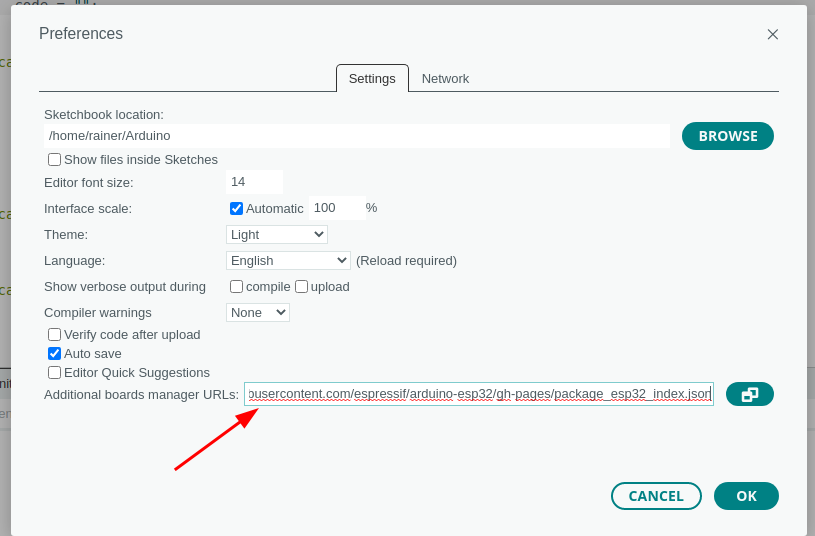
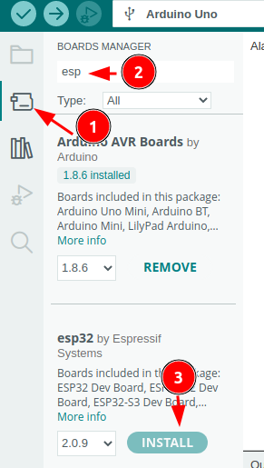
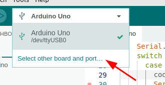

   <link rel="stylesheet" href="https://hi2272.github.io/StyleMD.css">

# ESP32 mit Arduino IDE programmieren
## 1. Arduino IDE auf ESP32 einstellen

Die Linux-Systeme in der Schule sind bereits für die Programmierung von ESP32-Chips vorbereitet. 

Wenn du deinen eigenen Rechner vorbereiten willst, kannst du nach folgender Anleitung vorgehen:  
### Boardinformationen herunterladen

1. Öffne das Voreinstellungsmenü über File.Preferences
2. Kopiere folgende Adresse in das Feld **Additional Board...**:
https://raw.githubusercontent.com/espressif/arduino-esp32/gh-pages/package_esp32_index.json  
3. Klicke auf **OK**

### Boardinformationen installieren
1. Öffne den Board-Manager:
2. Trage in das Suchfeld **esp** ein.
3. Installiere **esp32 by Espressif**  
   

   [Anleitung Script-Example.com](https://www.script-example.com/esp32)

## 2. ESP32 anschließen
Schließe den ESP32 mit dem Micro-USB-Kabel an einer der beiden Buchsen auf der rechten Seite des Rechners an.
## 3. Einstellen des ESP32 in der Software
Klicke auf die Pfeilspitze rechts von Select Board und wähle **Select other board and port**:  

1. Trage im Feld BOARDS **Node** ein.  
2. Klicke auf **NodeMCU32S**  
3. Wähle bei **PORTS** **/dev/tty/USB0 Serial Port (USB)**
4. Klicke auf **OK**  
   

[zurück](../../index.html)   

