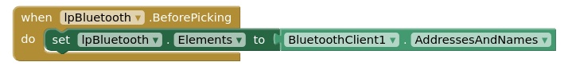

   <link rel="stylesheet" href="https://hi2272.github.io/StyleMD.css">

# MIT AppInventor
## 1. Allgemeines 

Über die Internet-Plattform [MIT App Inventor](https://appinventor.mit.edu) kannst du relativ einfach Bluetooth-Apps für dein Handy entwickeln. Auf dieser Seite musst du dich unter Angabe einer E-Mail-Adresse und eines Passworts registrieren.   
Mit der Handy-App **MIT AI Companion** [Android](https://play.google.com/store/apps/details?id=edu.mit.appinventor.aicompanion3&amp%3Bhl=de) [IOS](https://apps.apple.com/de/app/mit-app-inventor/id1422709355?ign-itscg=30200&ign-itsct=apps_box) können die Apps auf dem Handy installiert werden.  
Die genaue Beschreibung findest du hier:  https://appinventor.mit.edu/explore/ai2/setup-device-wifi

## 2. Online-Tutorials
Unter https://appinventor.mit.edu/explore/ai2/beginner-videos findest du eine Menge Tutorials, die dich schrittweise mit der AppInventor vertraut machen.

## 3. Bluetooth-Client als Empfänger von Daten
Um Bluetooth-Daten vom ESP32 auf dem Handy zu empfangen, benötigst du ein unsichtbares Element **Bluetooth-Client** aus dem Bereich **Connectivity**. Ziehe das Element auf den Handybildschirm in der Mitte.  
Außerdem benötigst du einen **Listpicker** aus dem **User Interface**:  
  
Bevor der Listpicker angeklickt wird, wird die Liste mit allen verfügbaren Bluetooth-Geräten gefüllt:  
  
Nachdem der Listpicker geschlossen wurde, wird die Verbindung zum Bluetoot-Gerät aufgebaut:   
  
- Das DelimiterByte ist das Zeichen für das Ende eines Datensatzes.  
10 steht für einen Zeilenumbruch.
- **lblBluetooth** wechselt von "Bluetooth nicht verbunden" zu "XYZ verbunden" und wird grün gefärbt.  

Um regelmäßig die eingehenden Bluetooth-Daten zu prüfen, brauchst du noch eine Komponente **Clock** aus dem Bereich **Sensors**. Das Zeitintervall wird auf 200ms gesetzt, d.h. 5 mal pro Sekunde wird geprüft, ob neue Nachrichten vorliegen.  
Mit diesem Code-Block werden die Nachrichten eingelesen:  
  
Die Daten werden in einer lokalen Variable **txt** gespeichert und können jetzt dargestellt werden.

### 4. Bluetooth-Client als Sender von Daten

Auf dieser Seite findest du eine gute Anleitung zum Senden von Daten vom App Inventor an den ESP:  
https://community.appinventor.mit.edu/t/bluetooth-hc-06-arduino-send-receive-send-text-file-multitouch-image/9518/2

[zurück](../../index.html)   