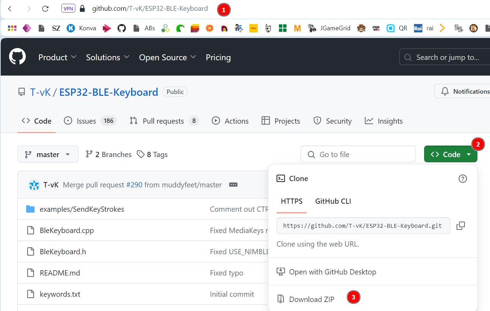
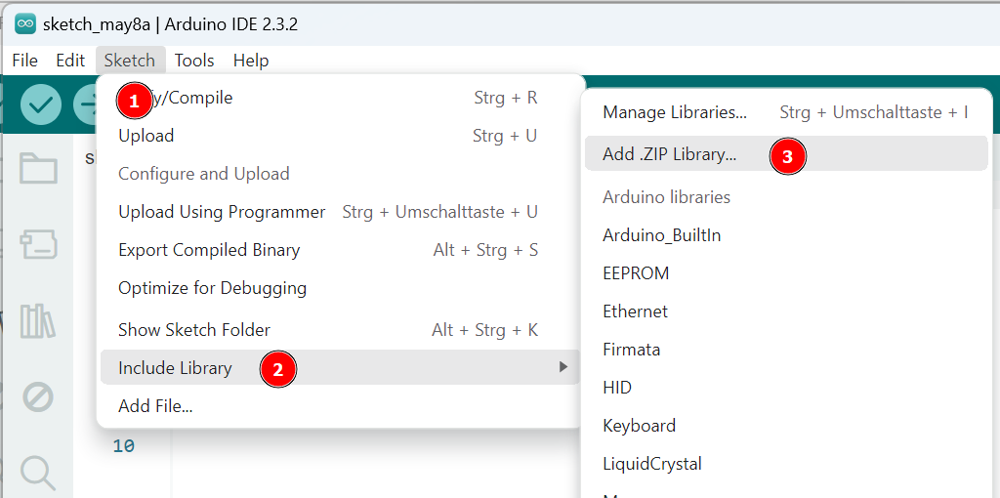

   <link rel="stylesheet" href="https://hi2272.github.io/StyleMD.css">

# BLE-Keyboard

Der Joystick soll jetzt über Bluetooth an den Computer angeschlossen werden und die Tastatursignale senden.  
Wir verwenden hierbei den Standard Bluetooth-Low-Energy (BLE), mit dem üblicherweise Tastaturen, Mäuse oder andere Eingabegeräte, die nur wenig Daten erzeugen, angeschlossen werden.  

## 1. Vorbereitung
Für die Programmierung benötigen wir eine Bibliothek, die du auf dieser Internetseite herunterladen kannst: [https://github.com/T-vK/ESP32-BLE-Keyboard](https://github.com/T-vK/ESP32-BLE-Keyboard)  
  
Speichere die ZIP-Datei an einem Ort, an den du sie wiederfindest.  
Anschließend müssen wir diese Bibliothek in unseren Sketch importieren:
1. Starte die Arduino-IDE.
2. Erstelle ein neues Projekt.
3. Importiere die Bibliothek als ZIP-Datei:  
   
## 4. Programmieren des Sketches
### 4.1 Aufbau der BLE-Verbindung
Kopiere diesen Code in deinen Sketch
```C++
#include <BleKeyboard.h>

BleKeyboard bleKeyboard;

int pinX = 12;
int pinY = 14;

void setup() {
  pinMode(pinX, INPUT);
  pinMode(pinY, INPUT);
  Serial.begin(115200);
  // Bluetooth einschalten -> Wartet auf Kopplung
  bleKeyboard.begin();
}
```
## Erläuterung des Codes
## #include <BleKeyboard.h>
Hier binden wir die Bibliothek in den Sketch ein, die wir vorher importiert haben.
## BleKeyboard bleKeyboard;
Wir erzeugen ein Objekt bleKeyboard der Klasse BleKeyboard, mit dem wir anschließend weiter arbeiten können.
## bleKeyboard.begin();
Der ESP32 arbeitet jetzt als BLE-Gerät und versucht sich mit einem Endgerät (Computer, Handy, etc.) zu koppeln.
### 2. Senden von Probedaten
```C++
void loop() {
  if (bleKeyboard.isConnected()) {
    int x = analogRead(pinX);
    int y = analogRead(pinY);

    if (x > 3000) {
      Serial.println("Links");
      bleKeyboard.press(KEY_LEFT_ARROW);
      delay(50);
    } else if (x < 1000) {
      Serial.println("Rechts");
      bleKeyboard.press(KEY_RIGHT_ARROW);
      delay(50);
    }
    if (y < 1000) {
      Serial.println("Hoch");
      bleKeyboard.press(KEY_UP_ARROW);
      delay(50);
    } else if (y > 3000) {
      Serial.println("Runter");
      bleKeyboard.press(KEY_DOWN_ARROW);
      delay(50);
   }
     bleKeyboard.releaseAll();
  }
}
```
## Erläuterung des Codes
## if(bleKeyboard.isConnected()) {
Der Code wird nur ausgeführt, wenn eine Bluetooth-Verbindung aufgebaut wurde.
## bleKeyboard.press(KEY_LEFT_ARROW);
Der ESP32 sendet den entsprechende Tastencode an den Computer - in diesem Fall den Code für die linke Cursor-Taste.
## bleKeyboard.releaseAll();
Mit diesem Befehl wird die Taste wieder gelöst - damit kann ein erneuter Tastendruck gesendet werden.
## 4.2 Aufbau der BLE-Verbindung
Wenn du den Sketch auf den ESP32 hochgeladen hast, ist das Gerät bereit, sich mit einem Computer zu koppeln.  
Am Rechner musst du jetzt in den Bluetooth-Einstellungen nach einem ESP32-Keyboard suchen und dieses Gerät koppeln.  
Anschließend sollte sich der Cursor mit dem Joystick bewegen lassen und du kannst Pac Man spielen:  
[Google Pac Man](https://www.google.com/logos/2010/pacman10-i.html)  

  


[zurück](../../index.html)   


       

