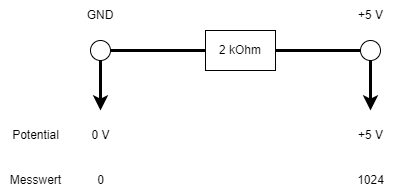
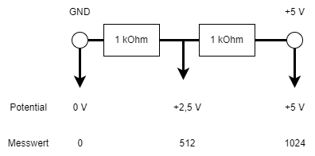

 <link rel="stylesheet" href="https://hi2272.github.io/StyleMD.css">

# Helligkeitsmessung
## 1. Prinzip der Helligkeitsmessung
Zur Messung der Helligkeit verwenden wir einen Fotowiderstand. Sein Widerstand hängt von der Helligkeit ab:  
Je heller er beleuchtet wird, desto kleiner ist sein Widerstand.  
Widerstände können am Arduino nicht direkt gemessen werden. Wir bauen unseren Fotowiderstand in einen Spannungsteiler ein.  
## 2. Prinzip der Messung
An den Analog-Pins A0-A5 kann der Arduino Potentiale messen und in Werte zwischen 0 und 1024 umwandeln:  

    
In diesem Fall fällt das Potential über den Widerstand um 5 V. Am Widerstand fallen 5 V Spannung ab.  
Wenn wir den 2 kOhm-Widerstand in zwei Widerstände zu je 1 kOhm aufteilen, können wir das Potential in der Mitte zwischen beiden Widerständen abgreifen. Da beide Widerständen gleich groß sind, fällt an jedem der gleiche Teil der gesamten Spannung ab. Am mittleren Punkt wird daher ein Wert von 512 gemessen:    
  
Sind die Widerstände unterschiedlich groß, dann fallen an ihnen auch unterschiedlich große Spannungen ab:  
  
##  3. Anschluss
Unsere Schaltung zur Messung der Beleuchtungsstärke entspricht genau diesem Schema:  
  
Der 1 kOhm-Widerstand ist konstant. Der Fotowiderstand ändert sich mit der Beleuchtung. Damit ändert sich auch der Messwert an Pin A5 mit der Beleuchtung.
## 3. Der Code
```C++
int foto = A5; 

void setup()  
{ 
  Serial.begin(9600); 
}

void loop()   
{ 
  int helligkeit = analogRead(foto); 
  Serial.println(helligkeit);
}
```

[zurück](../index.html)

<footer style="font-size:x-small;text-align: center;
    padding: 10px;
    margin: 10px;
    height: 10%;
    ">


  Die Schaltpläne sind mit <a href="https://www.tinkercad.com/dashboard">Tinkercad</a> erstellt. 
</footer>

