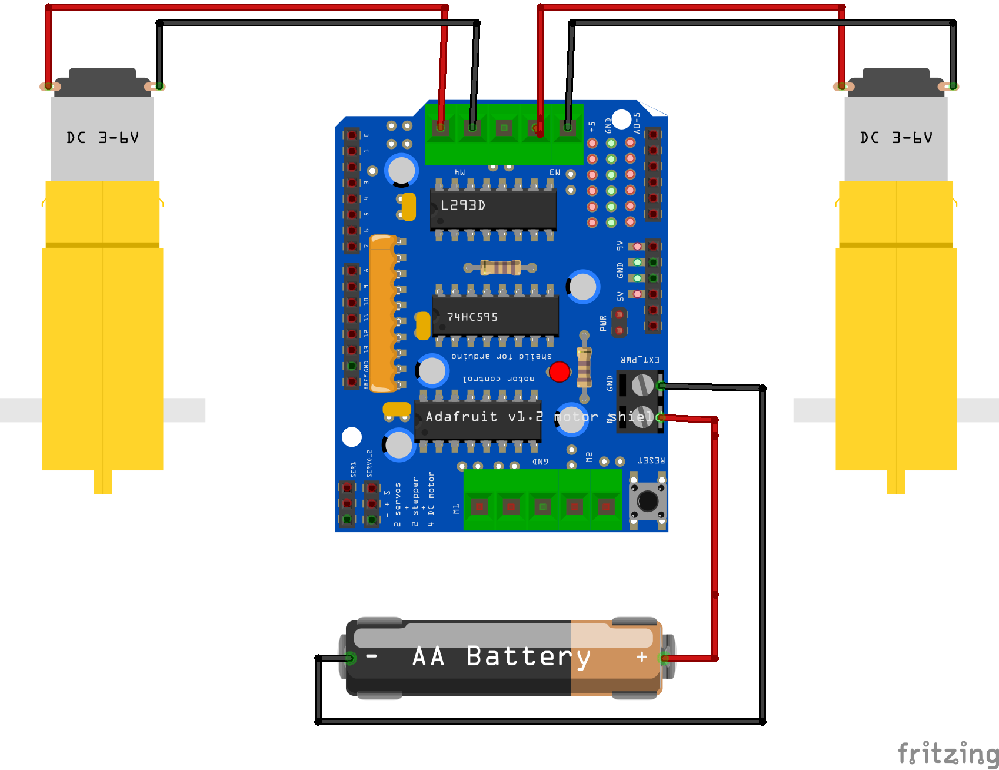
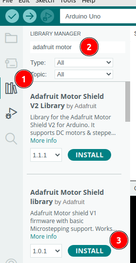

 <link rel="stylesheet" href="https://hi2272.github.io/StyleMD.css">

# Das Adafruit Motorshield
Das Motorshield wird direkt auf den Arduino Uno aufgesteckt.
An das Shield können vier Gleichstrom-Motoren und zwei Servo-Motoren angeschlossen werden.
Außerdem stehen noch 6 GPIO-Pins des Arduinos zur Verfügung.  
## 1. Anschluss der Batterien und der Motoren
  

Wir verwenden die oberen Schraubkontakte zum Anschluss der beiden Motoren.  
An die beiden Schraubkontakte auf der rechten Seite werden die Batterikästen angeschlossen. Das Board, der Arduino und die Motoren werden hierdurch mit Spannung versorgt. Insgesamt liegt eine Spannung von 6 x 1,5 V = 9 V an.

## 2. Installation der Motorshield-Biblitothek
1. Öffne den Bibliotheksmanager.
2. Suche nach **Adafruit Motor**.
3. Installiere die Bibliothek für die Version V1:  
     
   Es gibt zwei Versionen des Motorshields - wir verwenden die ältere Version und benötigen die dafür passende Bibliothek.

[zurück](../index.html)
