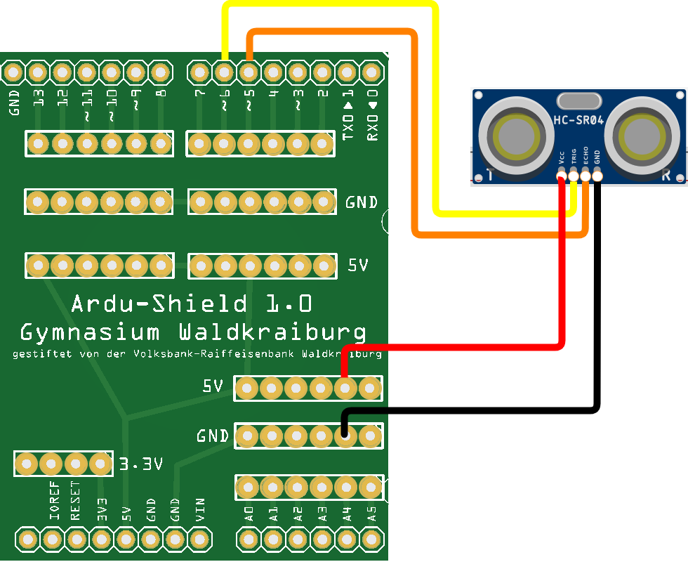

 <link rel="stylesheet" href="https://hi2272.github.io/StyleMD.css">

# Der Ultraschallsensor HC-SR04
## 1. Prinzip der Entfernungsmessung
Am Ultraschallsensor fallen die beiden Aluminiumzylinder mit Gitternetzen auf:  
  
Zur Entfernungsmessung wird zunächst vom linken Zylinder, der einen Lautsprecher enthält, ein kurzes Ultraschall-Signal ausgesendet. Ultraschalltöne sind so hoch, dass sie vom Menschen nicht wahrgenommen werden können.  
Der Schall prallt auf ein Objekt und wird von diesem zurückgeworfen. Sobald das reflektierte Signal am Sensor ankommt, wird es vom rechten Zylinder, der ein Mikrofon enthält, wahrgenommen.  
Aus der Zeit, die zwischen den Aussenden des Signals und dem Empfangen des reflektierten Signals vergeht, kann die Entfernung zum Objekt berechnet werden.
##  2. Anschluss
Schließe den Sensor nach folgendem Schema an:  


## 3. Programmierung des Sensors
Erstelle einen neuen Sketch und speichere ihn unter dem Namen Ultraschall.
### 1. Festlegen der Pins
```C++
int trigger=6;  // Trigger zum Senden des Signals 
int echo=5;     // Echo zum Empfangen des relektierten Signals
```
### 2. Die setup()-Methode
In der **setup()**-Methode startest du die serielle Datenübertragung und legst die beiden Pins als Ausgang und Eingang fest.
```C++
void setup()
{
Serial.begin (9600); 
pinMode(trigger, OUTPUT); // Trigger-Pin ist ein Ausgang
pinMode(echo, INPUT); // Echo-Pin ist ein Eingang
}
```

### 3. Die loop()-Methode

```C++
void loop()
{
  digitalWrite(trigger, LOW); 
  delay(5); 
  digitalWrite(trigger, HIGH); 
  delay(10); 
  digitalWrite(trigger, LOW);

  int dauer = pulseIn(echo, HIGH); 
  int entfernung = (dauer/2) * 0.03432; 
  Serial.print(entfernung);
  Serial.println(" cm");

  delay(1000); 
}


```
### Erklärung des Codes
    
**digitalWrite(trigger, LOW);**  
**delay(5);** 
  
Zunächst wird der Trigger 5 ms ausgeschaltet, damit er sicher ein sauberes Signal liefert.
  
**digitalWrite(trigger, HIGH);** 
**delay(10);**   
**digitalWrite(trigger, LOW);**  
  
Anschließend wird für 10 ms ein Ultraschallsignal ausgegeben
   
**int dauer = pulseIn(echo, HIGH);**   
  
Über die **pulseIn()**-Funktion wird die Zeit gemessen, bis der echo-Pin das reflektierte Signal empfängt und HIGH geschaltet wird.  
Der Wert wird in Mikrosekunden, also in Millionstel Sekunden ausgegeben.

**int entfernung = (dauer/2) * 0.03432;**
  
Zur Berechnung der Entfernung in cm wird die Zeit zunächst durch 2 geteilt, da nicht der Hin- und Rückweg des Signals, sondern nur der einfache Weg gemessen werden soll.  
Anschließend wird diese Zeit mit dem Weg mulitipliziert, den der Schall in einer Mikrosekunde zurücklegt:  
Schallgeschwindigkeit = 1235,5 km/h = 343,2 m/s = 0,0003432 m/µs = 0,0343 cm/µs  

[zurück](../index.html)
