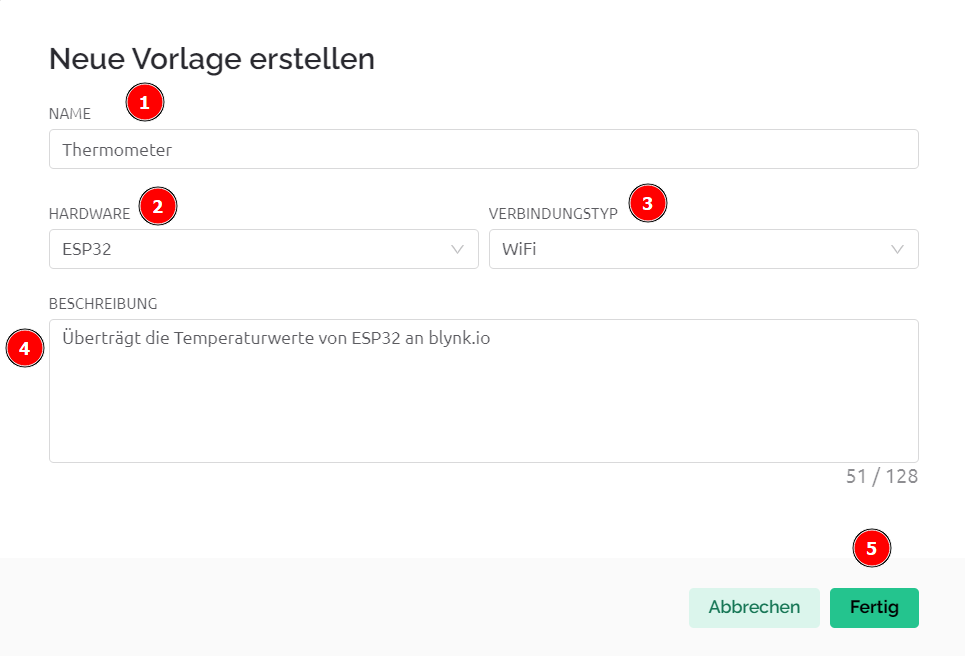
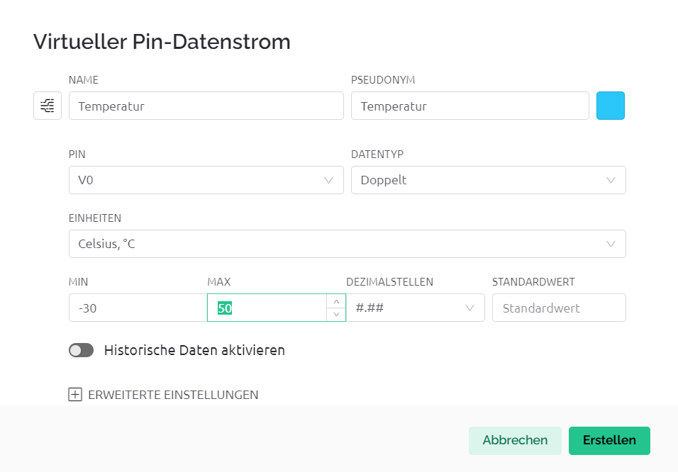
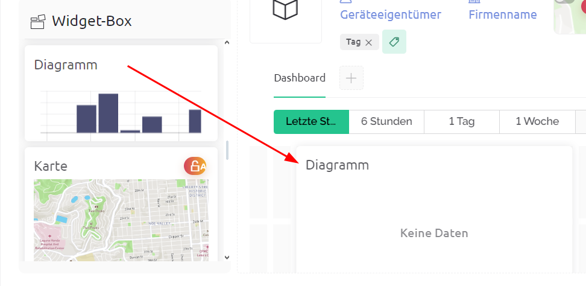
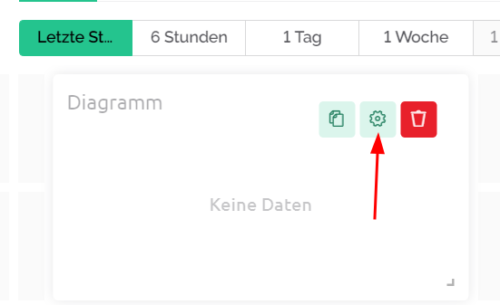
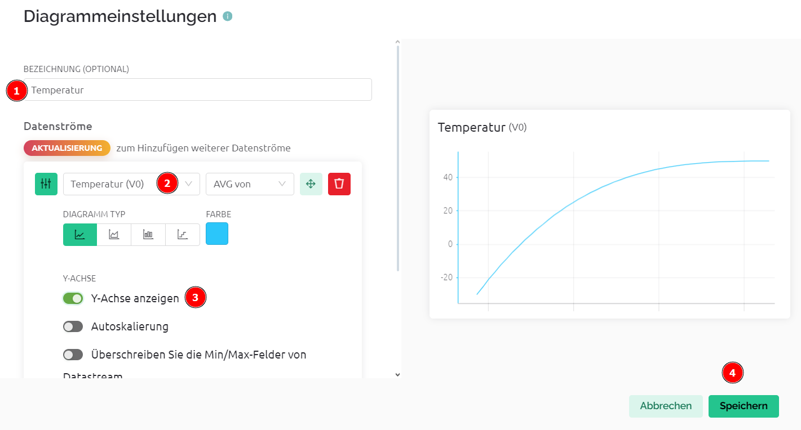
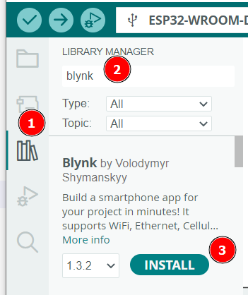

 <link rel="stylesheet" href="https://hi2272.github.io/StyleMD.css">

# Temperaturwerte ins Internet schicken
## 1. Grundlagen
Das Internet der Dinge (Internet of Things, IoT) besteht aus Mikrocontrollern, die über das Internet mit Server-Rechnern verbunden sind. Sie können Daten an den Server senden und Befehle von ihm empfangen.  
Der Mikrocontroller ESP32 kann sich im Wlan anmelden und darüber ins Internet gehen.  
Als IoT-Dienst verwenden wir [Blynk](https://blynk.io). Diese Firma betreibt IoT-Server, die rund um die Uhr über das Internet erreichbar sind.
##  2. Anmeldung bei Blynk
1. Gehe auf die Internetseite [blynk.io](https://blynk.io).
2. Klicke auf **Start free**
3. Erstelle mit deiner E-Mail-Adresse einen neuen Account. 
4. Bestätige den Account in der E-Mail, die dir automatisch geschickt wurde. 
  
Die kostenlose Version hat einige Einschränkungen. Sie reicht aber für unsere Zwecke voll aus.

## 3. Neue Vorlage zur Temperaturmessung erstellen
1. Logge dich bei Blynk ein.
2. Klicke links oben auf **Developer Zone**.
3. Klicke rechts oben auf **+Neue Vorlage**.
4. Fülle das Formular aus und klicke auf **Fertig**:  


## 4. Datenströme einrichten
Über einen Datenstrom kann ein Typ von Information zwischen dem Mikrocontroller und dem Blynk-Server ausgetauscht werden. Bei unserem Aufbau benötigen wir einen Datenstrom für die Temperatur-Messwerte.  
1. Klicke auf **Datenströme einrichten**.
2. Klicke auf **+Neuer Datenstrom**.
3. Wähle **Virtueller Pin** und fülle das Formular aus und klicke auf **Erstellen**:  
   

## 5. Temperatur-Diagramm erstellen
1. Klicke auf **Web-Dashboard**
2. Suche in der **Widget-Box** ein **Diagramm** und ziehe es nach rechts auf das Dashboard:  
    
3. Klicke auf das Zahnrad im Diagramm  
  
4. Fülle das Formular aus und klicke auf Speichern.  
     

## 6. Vorlage speichern
Klicke rechts oben auf Speichern, um die neu erstellte Vorlage **Temperatur** zu speichern.  

## 7. ESP32 bei Blynk anmelden
1. Klicke auf **Hause** (engl. Home).
2. Wähle **Fügen Sie Ihr erstes Gerät hinzu**.
3. Trage als Namen **Thermometer** ein.
4. Klicke auf **Erstellen**.  
Blynk hat deinem System jetzt mehrere eindeutige Id-Nummern gegeben, die du später im Arduino-Sketch einfügen musst:  
- BLYNK_TEMPLATE_NAME "Thermometer": Name der Vorlage, die du erstellt hast.
- BLYNK_TEMPLATE_ID "TMP...": Id dieser Vorlage.
- BLYNK_AUTH_TOKEN "AMT...": Id des Gerätes, das du erstellt hast.
Mit diesen Kennzahlen erkennt Blynk das Gerät und ruft automatisch das passende Web-Dashboard auf.

## 8. ESP32 programmieren
1. Starte die Arduino IDE.
2. Schließe den ESP32 über USB an den Rechner an.
3. Installiere die Blynk-Bibliothek:  
     
4.  Erstelle einen neuen Sketch
5.  Kopiere diesen Code in den Sketch:
```C++
// Konstanten für die Anbindung an blynk.io

#define BLYNK_TEMPLATE_NAME "" // Dein Wert von blynk.io
#define BLYNK_AUTH_TOKEN "" // Dein Wert von blynk.io
#define BLYNK_TEMPLATE_ID "" // Dein Wert von blynk.io

// Ermöglicht die Ausgabe von Nachrichten der blynk.io-Seite
// an die Serielle Schnittstelle.
// Kann auch gelöscht werden, um Daten zu sparen
#define BLYNK_PRINT Serial

// Bibliotheken einbinden
#include <WiFi.h>
#include <WiFiClient.h>
#include <BlynkSimpleEsp32.h>
#include <Arduino.h>
#include <OneWire.h>
#include <DallasTemperature.h>

// Wifi Zugangsdaten
char ssid[] = ""; // Dein Netzwerk
char pass[] = ""; // Dein Kennwort

// Temperaturmessung
int tempPin=34;
OneWire oneWire(tempPin);
DallasTemperature sensors(&oneWire);


// Timer zum zeitgesteuerten Senden der Daten an blynk.io
BlynkTimer timer;

// Timer-Funktion
// Hier muss das Senden der Daten an blynk.io programmiert werden

void myTimerEvent()
{
  // Sende Signal zum Abfragen der Temperatur
  sensors.requestTemperatures(); 
  // Lese den Wert des Sensors mit dem Index 0 (es können mehrere Sensoren angeschlossen werden)
  float tempC = sensors.getTempCByIndex(0); 
  // Sendet den Messwert an den Virtuellen Pin V0
  // von blynk.io
  Blynk.virtualWrite(V0, tempC);
  Serial.println(tempC);
}

void setup()
{
  Serial.begin(115200);

  // Baut die Verbindung zum blynk.io Server auf
  Blynk.begin(BLYNK_AUTH_TOKEN, ssid, pass);

  // Legt fest, wie oft die Timer-Funktion myTimerEvent aufgerufen wird
  // 5000L bedeutet 5000 ms als long-Wert
  // d.h. die Daten werden alle 5 Sek. erfasst und an blynk.io gesendet 
  timer.setInterval(5000L, myTimerEvent);
}

void loop()
{
  // Startet die Routinen für Blynk 
  Blynk.run();

  // Startet dieTimerfunktion
  // damit wird die Funktion myTimerEvent regelmäßig aufgerufen
  // ACHTUNG: Es darf keine delay()-Funktion verwendet werden!
  timer.run();
  
}

```
  

[zurück](../index.html)

<footer style="font-size:x-small;text-align: center;
    padding: 10px;
    margin: 10px;
    height: 10%;
    ">


  Die Schaltpläne sind mit <a href="https://www.tinkercad.com/dashboard">Tinkercad</a> erstellt. 
</footer>

