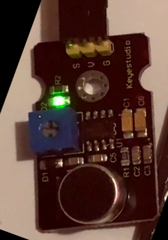

<link rel="stylesheet" href="https://hi2272.github.io/StyleMD.css">

# Das Mikrofon

## Allgemeines
Das Mikrofon-Modul wird über drei Kabel an den Arduino angeschlossen:
- V : + Pol am Arduino (+5 V)
- G : - Pol am Arduino (GND)
- S : Signal- oder Datenkabel: Pin A0 am Arduino

Die Lautstärke des Mikrofons wird als analoges Signal am Pin A0 ausgelesen. Die Werte liegen zwischen 0 (leise) und 1023 (laut).

## Programmierung
Der Code zum Auslesen des Mikrofons ist sehr einfach:

```C++

// Mikrofon-Pin
const int MIC_PIN = A0;

void setup() {
  Serial.begin(9600);      // Serielle Kommunikation starten
}

void loop() {
  int micValue = analogRead(MIC_PIN);  // Mikrofonwert lesen
  Serial.println(micValue);
  delay(100);    // Kurze Pause
}
```

[weiter zum Partylicht](Partylicht.html)  
[zurück zur LED-Matrix](index.html)  
[zurück zum Hauptverzeichnis](../index.html)
