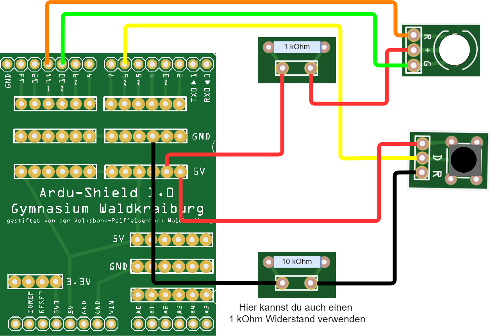

<link rel="stylesheet" href="https://hi2272.github.io/StyleMD.css">

# Taster!

## Ein digitaler Taster startet ein Blinklicht

  


### Blink-Code:
```C++
// Variable zur Speicherung der Zeit
int zeit = 0;

void setup() {
  // Setzt den Pin 6 als Eingang (INPUT) für einen Taster
  pinMode(6, INPUT);
  
  // Setzt die Pins 10 und 11 als Ausgänge (OUTPUT) für die Steuerung von LEDs oder ähnlichem
  pinMode(10, OUTPUT);
  pinMode(11, OUTPUT);
}

// Funktion zum Einschalten der roten LED
void rot() {
 digitalWrite(10, HIGH); // Setzt Pin 10 auf HIGH (grünes Licht aus)
 digitalWrite(11, LOW);  // Setzt Pin 11 auf LOW (rotes Licht an)
}

// Funktion zum Einschalten der grünen LED
void gruen() {
  digitalWrite(10, LOW);  // Setzt Pin 10 auf LOW (grünes Licht an)
  digitalWrite(11, HIGH); // Setzt Pin 11 auf HIGH (rotes Licht aus)
}

// Funktion zum Ausschalten beider LEDs
void aus() {
  digitalWrite(10, HIGH); // Setzt Pin 10 auf HIGH (rotes Licht aus)
  digitalWrite(11, HIGH); // Setzt Pin 11 auf HIGH (grünes Licht aus)
}

void loop() {
  // Liest den aktuellen Zustand des Tasters am Pin 6
  int wert = digitalRead(6);
  
  // Wenn der Taster gedrückt ist
  if (wert == HIGH) {
    zeit = 3000; // Setzt die Zeit auf 3000 Millisekunden (3 Sekunden)
    
    // Wartet, bis der Taster losgelassen wird
    while (digitalRead(6) == HIGH) {}
  }
  
  // Wenn die Zeit größer als 0 ist, wird weitergearbeitet
  if (zeit > 0) {
    // Wenn der aktuelle Zeitwert modulo 300 größer als 150 ist, wird die rote LED eingeschaltet
    // Somit wird die LED abwechselnd rotes und grünes Licht für die Dauer von "zeit" anzeigen
    if (zeit % 300 > 150) {
      rot(); // Rot einschalten
    } else {
      gruen(); // Grün einschalten
    }
  } else {
    aus(); // Schaltet beide LEDs aus, wenn die Zeit abgelaufen ist
  }
  
  // Verringert den Zeitwert um 1
  zeit = zeit - 1;
  
  // Wartet 1 Millisekunde
  delay(1);
}

```
### Erläuterungen zum Code

Die Zeile **if (zeit % 300 > 150) {** ist für das Blinken der LED verantwortlich.  
Das Modulo-Zeichen **%** ergibt den Rest der Division der Variable zeit durch 300.  
Wenn Zeit von 0 bis 3000 steigt, steigt das Ergebnis von **zeit%300** 10 mal von 0 auf 299.  
### Aufgabenstellung
Ändere diese Zeile so ab, dass
- die LED länger grün als rot leuchtet.
- die LED länger grün und rot leuchtet.

  

[zurück](../index.html)
