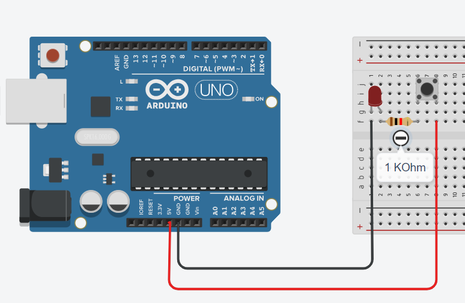

<link rel="stylesheet" href="https://hi2272.github.io/StyleMD.css">

# Taster
## Ein Taster im Stromkreis

  
In dieser Schaltung funktioniert der Taster als elektrisches Schaltelement:  
- Solange du den Taster drückst, ist der Stromkreis geschlossen und die LED leuchtet. 
- Wenn du den Taster loslässt, öffnest du den Stromkreis und die LED erlischt.
- Der Arduino dient hier nur als Spannungsquelle für den Stromkreis.  

## Ein Taster als digitaler Sensor
Im folgenden wollen wir die LED durch einen kurzen Druck auf den Taster ein- und wieder ausschalten können.  
Baue hierzu deine Schaltung um:  

Der Taster ist jetzt nicht mehr direkt an die LED angeschlossen. Die LED kann vielmehr vom Arduino aus geschaltet werden.
Erstelle einen Code, mit dem die gelbe LED blinkt und teste ihn.  

[Lösung](DigitaltasterLsg.html)
  
  

[zurück](../index.html)
