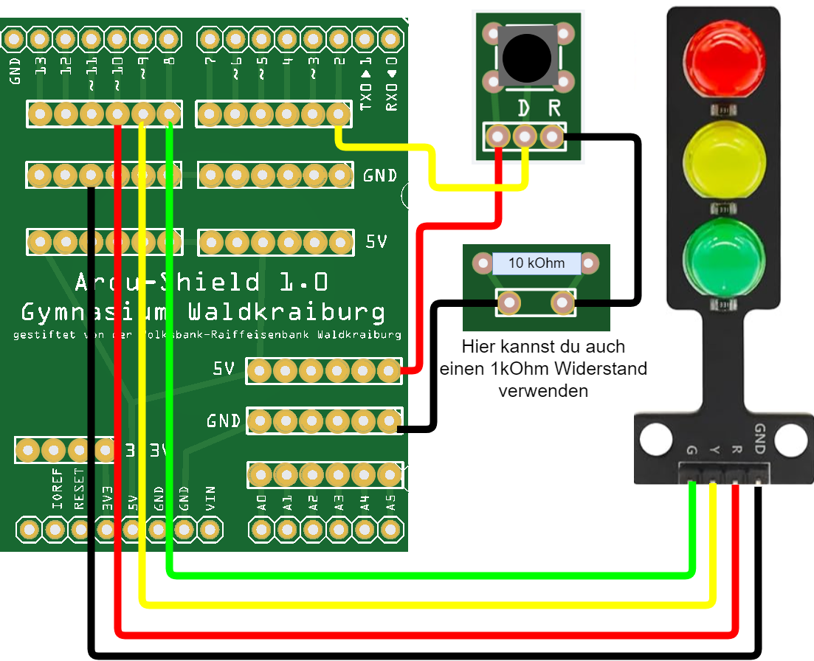

<link rel="stylesheet" href="https://hi2272.github.io/StyleMD.css">

# Taster

## Ein Taster als digitaler Sensor


### Blink-Code:
```C++
void setup() {
  pinMode(8, OUTPUT);
  pinMode(9, OUTPUT);
  pinMode(10, OUTPUT);
  
  digitalWrite(8,LOW);  // aus
  digitalWrite(9,LOW);  // aus
  digitalWrite(10,LOW);  // aus


}

void loop() {
  digitalWrite(9, HIGH); // ein
  delay(500);            // 500 ms Pause: gelbe LED leuchtet
  digitalWrite(9, LOW);  // aus
  delay(500);            // 500 ms Pause: gelbe LED leuchtet nicht.
}
```
### Taster-Code
Als nächstes bauen wir den Taster in unseren Sketch ein:  
```C++
bool zustand=LOW;
int taster=2;
int ledPin=6

void setup() {
  pinMode(ledPin, OUTPUT);
  digitalWrite(ledPin,LOW);  // aus
  
  pinMode(taster,INPUT);  
}

void loop() {
  if (digitalRead(taster)==HIGH){
    if (zustand==LOW){
        zustand=HIGH;
    } else {
        zustand=LOW;
    }
   digitalWrite(6, zustand); // ein
   delay(1000);
  }  
  delay(1);
}
```
### Erläuterungen zum Code
#### bool zustand=LOW;
Wir definieren eine Variable, die den Zustand unserer LED speichert. Zu Beginn soll sie ausgeschaltet (LOW) sein.  
Der Datentyp bool lässt nur zwei Werte zu:  
- false = 0 = LOW
- true = 1 = HIGH  

Wir verwenden ihn, um zu speichern, ob unsere LED ein- oder ausgeschaltet ist.
#### if (digitalRead(taster)==HIGH){
Mit dieser Zeile wird geprüft, ob der Taster gedrückt ist. Der Arduino liest dazu das Potential des Pins D2 ab, der mit dem Taster verbunden ist.
- Wenn der Taster gedrückt ist, verbindet er D2 mit dem +5V-Pin des Arduinos. Damit liegen diese 5 V an D2 an und der Pin ist HIGH.  

- Wenn der Taster nicht gedrückt ist, ist Pin2 über den 10 kOhm Widerstand mit GND verbunden. Er wird damit auf LOW heruntergezogen (engl. Pull Down). 
- Der Widerstand verhindert einen Kurzschluss zwischen +5V und GND, wenn der Taster gedrückt ist. (Pull-Down-Widerstand)
#### if (zustand==LOW){...
Hier wird die LED ein- oder ausgeschaltet. 
#### delay(1000);
Die Pause von 1000 ms soll verhindern, dass ein Tastendruck mehrfach ausgelesen wird.
    


[verbesserter Code](DigitaltasterBesser.html)
  
  
  

[zurück](../index.html)
