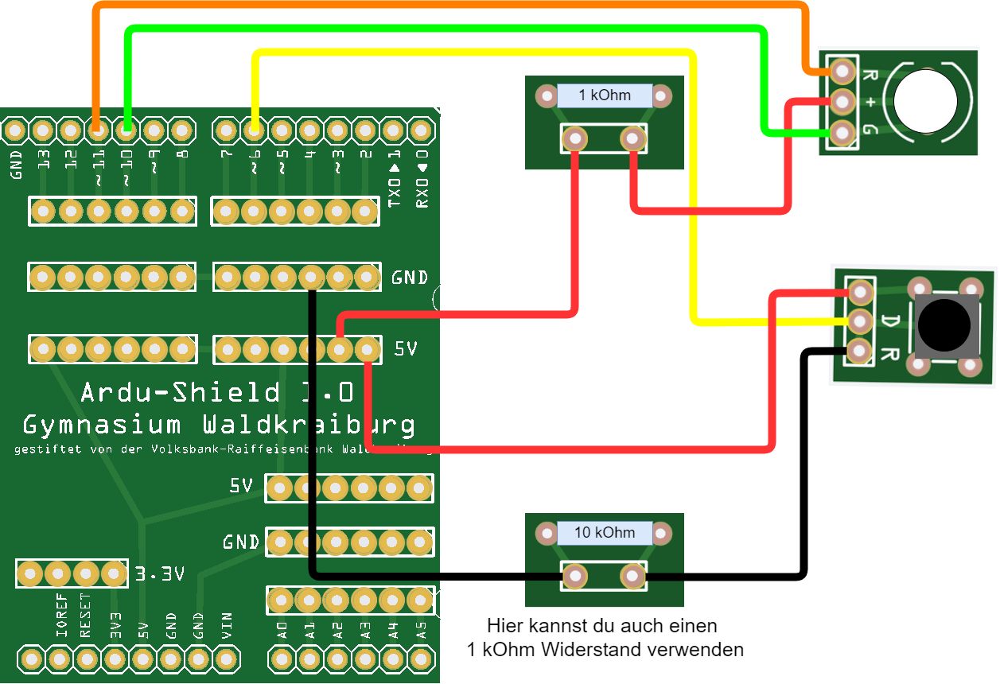

<link rel="stylesheet" href="https://hi2272.github.io/StyleMD.css">


# Reaktionszeit messen
## Schaltung
  

## Code
```C++
int rot=2;
int gruen=3;
int taster=6;
int zeit=0;

void setup(){
    pinMode(rot,OUTPUT);
    pinMode(gruen,OUTPUT);
    pinMode(taster,INPUT);
    digitalWrite(gruen,HIGH);
    digitalWrite(rot,LOW);
    Serial.begin(9600);
}

void loop(){
    while (digitalRead(taster)==LOW){
        delay(1);
    }
    while (digitalRead(taster)==HIGH){
        delay(1);
    }

    zeit=millis()+Random...
    while (millis()<zeit){
        delay(1);
    }
    digitalWrite(gruen,LOW);
    digitalWrite(rot,HIGH);
    zeit=millis();
    while (digitalRead(taster)==LOW){
        delay(1);
    }
    zeit=millis()-zeit;
    Serial.println("Reaktionszeit"+String(zeit)+" ms.");
    while (digitalRead(taster)==HIGH){
        delay(1);
    }
}
```
### Erläuterungen zum Code
#### Serial.begin(9600);
Startet die Serielle Schnittstelle mit einer Datenrate von 9600 Baud.  
Damit können Texte über das USB-Kabel an den Computer geschickt werden und im Seriellen Monitor dargestellt werden.
####  Serial.println("Reaktionszeit"+String(zeit)+" ms.");
Mit diesem Befehl wird die Reaktionszeit am Computer dargestellt.    
#### 

[zurück](../index.html)
