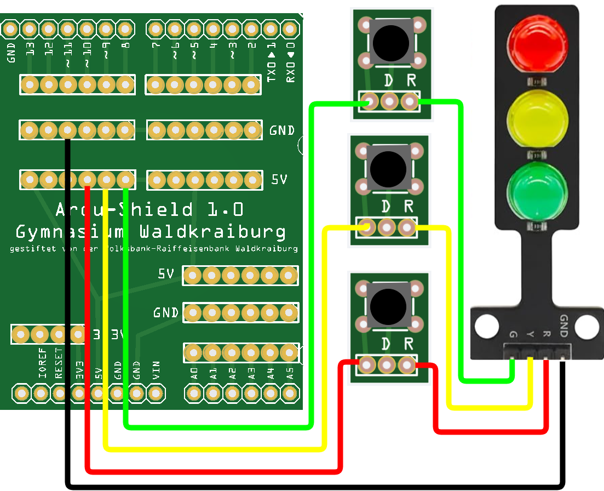

<link rel="stylesheet" href="https://hi2272.github.io/StyleMD.css">
<link rel="stylesheet" href="https://hi2272.github.io/StyleMD.css">

# Taster
## Ein Taster im Stromkreis

Baue diese Schaltung auf und probiere sie aus:  
  
[weiter](Digitaltaster.html)
  
  

[zurück](../index.html)
