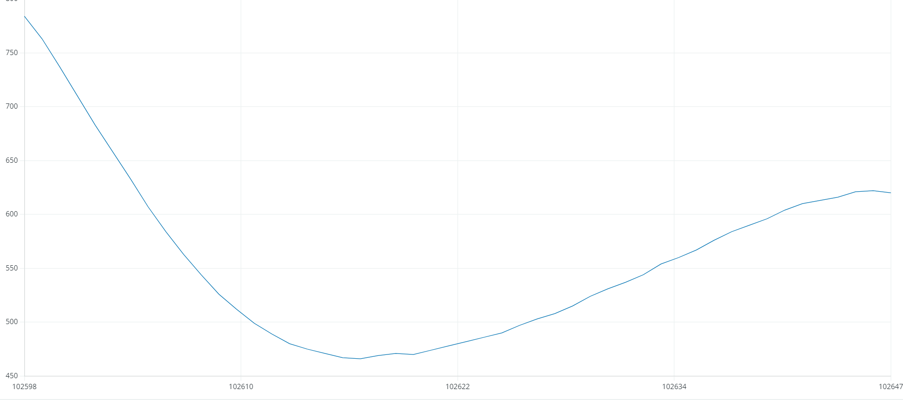

<link rel="stylesheet" href="https://hi2272.github.io/StyleMD.css">
<link rel="stylesheet" href="https://hi2272.github.io/StyleMD.css">

# Der Pulssensor
## Messprinzip

Pulssensoren sind zum Beispiel in Fitness-Uhren eingebaut. Sie bestehen aus einer grünen LED und einer Fotozelle. Das grüne Licht wird vom roten Blutfarbstoff (Hämoglobin) absorbiert. Je weiter die Blutgefäße sind, desto mehr Blut und damit Hämoglobin wird durchleuchtet, desto mehr grünes Licht wird absorbiert, desto weniger grünes Licht gelangt zur Fotozelle.

## Anschluss
Der Pulssensor wird über 3 Kabel an den Arduino angeschlossen

|Sensorpin|Arduino|
|--|--|
|S|A0|
|-|GND|
|mittlerer Pin|5V oder 3,3V|

## Programmierung
Für die Programmierung werden keine Bibliotheken benötigt. Wir lesen nur regelmäßig den analogen Wert von Pin A0 ein:

```c++
void setup(){
    Serial.begin(9600); // Serielle Schnittstelle starten
    pinMode(A0,INPUT);

}

void loop(){
    int wert=analogRead(A0);
    Serial.println(wert);
}
```
Lade den Sketch hoch und teste ihn mit dem Seriellen Plotter.

Lege deinen Finger **leicht** auf das weiße Herz. Am Plotter sollte eine regelmäßige Wellenlinie erscheinen:
  
Um die Darstellung zu glätten, definieren wir einen Grenzwert.    
Nur wenn der Messwert diesen Grenzwert überschreitet, soll er ausgegeben werden, sonst soll 0 ausgegeben werden:
``` C++
int grenze=600;

void setup(){
    Serial.begin(9600); // Serielle Schnittstelle starten
    pinMode(A0,INPUT);

}

void loop(){
    int wert=analogRead(A0);
    if (wert>grenze){
        Serial.println(wert);

    } else {
        Serial.println(0);
    }
}
```
Um den Puls unabhängig von der Seriellen Schnittstelle anzuzeigen soll, die eingebaute LED am Pin13 im Pulstakt blinken. Hierzu ändern wir den loop-Teil etwas ab:
``` C++
int grenze=600;

void setup(){
    Serial.begin(9600); // Serielle Schnittstelle starten
    pinMode(A0,INPUT);

}

void loop(){
    int wert=analogRead(A0);
    if (wert>grenze){
        Serial.println(wert);
        digitalWrite(13,HIGH);

    } else {
        Serial.println(0);
        digitalWrite(13,LOW);
    }
}
```


Der Puls wird in Schlägen pro Minute ausgegeben. Um ihn zu ermitteln müssen wir also zum einen die Schlagzahl und zum anderen die Zeit messen.
### Bestimmung der Schlagzahl
Um die Schlagzahl zu ermitteln, definieren wir eine Variable und erhöhen sie immer um 1, wenn unser Messwert die Grenze überschreitet.  
Damit jeder Herzschlag nur einmal registriert wird, warten wir nach dem Zählen, bis der Messwert wird unter der Grenze liegt.
``` C++
int grenze = 600;
int anz = 0;

void setup() {
  Serial.begin(9600);  // Serielle Schnittstelle starten
  pinMode(A0, INPUT);
}

void loop() {
  int wert = analogRead(A0);
  if (wert > grenze) {
    anz = anz + 1;
    Serial.println(anz);
    digitalWrite(13,HIGH);
    while (analogRead(A0) > grenze) {
      delay(1);
    }
    digitalWrite(13,LOW);
  }
}

```

### Zeitmessung
Zur Zeitmessung verwenden wird die Methode **millis()**:
```c++

int grenze = 600;
int anz = 0;
long zeit;

void setup() {
  Serial.begin(9600);  // Serielle Schnittstelle starten
  pinMode(A0, INPUT);
  zeit = millis();
}

void loop() {
  int wert = analogRead(A0);
  if (wert > grenze) {
    anz = anz + 1;
    double dauer = (millis() - zeit) * 1.0 / 1000;
    zeit = millis();
    double puls = 60 / dauer;

    Serial.println(String(anz) + " Dauer : " + String(dauer) + " Puls: " + String(puls));
    
    digitalWrite(13, HIGH);
    while (analogRead(A0) > grenze) {
      delay(1);
    }
    digitalWrite(13, LOW);
  }
}
```
### Erläuterungen zum Code
Der Puls wird in diesen Code-Zeilen berechnet:
```C++
  double dauer = (millis() - zeit) * 1.0 / 1000;
  zeit = millis();
  double puls = 60 / dauer;
```
Die Funktion **millis()** liefert die Zeit, die seit dem Einschalten des Arduinos vergangen ist in Millisekunden.  
Die Variable **dauer** enthält die Zeit in Sekunden, die pro Pulsschlag benötigt wird. Hierzu ziehen wir von der aktuellen **millis()**-Zeit die letzte gespeicherte Zeit ab und teilen das Ergebnis durch 1000.  
Anschließend speichern wir die aktuelle Zeit für die nächste Messung.  
Um den Puls zu ermitteln, d.h. die Anzahl der Schläge, die das Herz pro Minute macht, teilen wir 60 Sekunden durch die Dauer eines Schlages.

Um den dargestellten Puls zu glätten, können wir Mittelwerte aus mehreren Messwerten bilden.


[zurück](../index.html)
