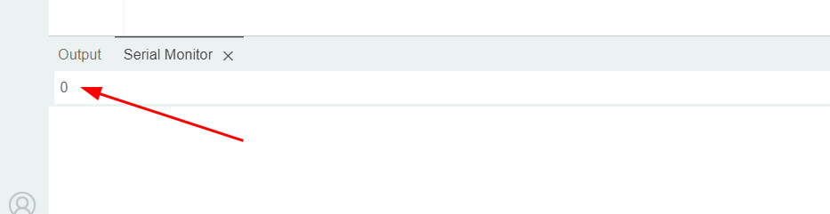

<link rel="stylesheet" href="https://hi2272.github.io/StyleMD.css">
<link rel="stylesheet" href="https://hi2272.github.io/StyleMD.css">

# Daten an den Arduino senden
## Prinzip
Über die Serielle Schnittstelle kann der Arduino Daten mit dem Computer austauschen.   
Wir untersuchen, in welcher Form der Arduino Daten vom Computer empfängt.
## Programmierung
```c++
int zeichen = 0;  // Datenbyte vom Seriellen Eingang
String txt = "";  // Ausgabe als Text

void setup() {
  Serial.begin(9600);  // Serielle Schnittstelle öffnen
}

void loop(){
  if (Serial.available() > 0) {   // Serielle Daten liegen an
    zeichen = Serial.read();      
    Serial.println(zeichen);
  }
}

```
### Erläuterung des Codes
- Die Methode **Serial.available()** gibt immer dann einen anderen Wert als 0 aus, wenn der Arduino Daten über die Serielle Schnittstelle empfängt.  
- Mit **Serial.read()** werden diese Daten eingelesen.

### Aufgabenstellung
Lade das Programm auf den Arduino hoch und öffne die Serielle Schnittstelle.   
Trage die Ziffer "0" ein und drücke **Return**, um sie über die Serielle Schnittstelle an den Arduino zu senden:  
  
Sende folgende Zeichen an den Arduino:
- 1
- 2
- 3
- 12
- 13
- A
- B
- a
- b
- AB
Beantworte folgende Fragen:
1.  Wie wird das RETURN-Zeichen codiert?
2.  Welche Code entspricht dem Zeichen "4"?  
Teste deine Hypothese!
3.  Wie werden Zeichenketten mit mehreren Zeichen codiert?

[weiter](Loesung.html)  
[zurück](../index.html)
