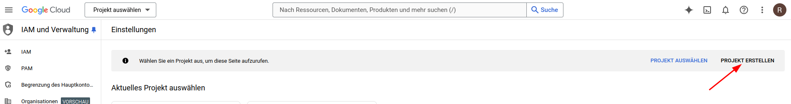
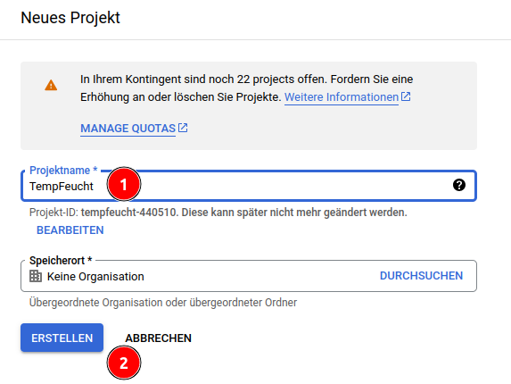
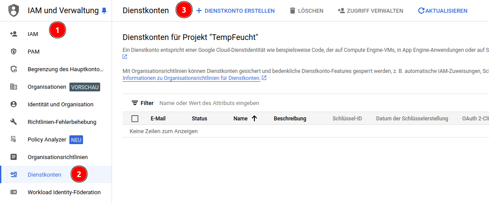
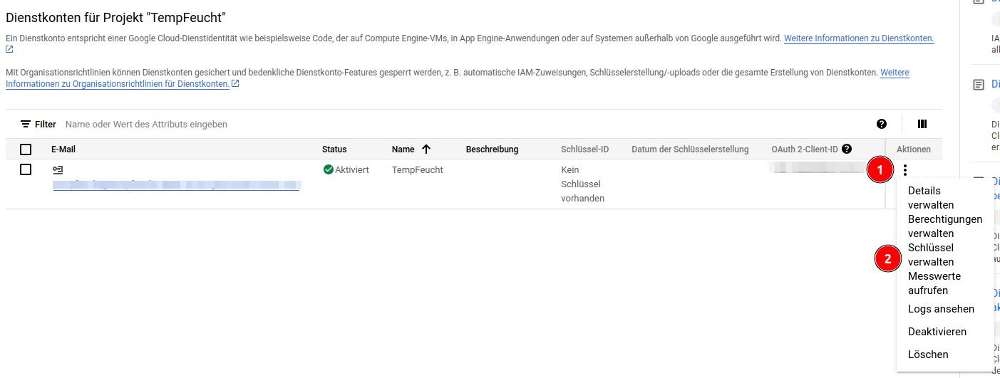

<link rel="stylesheet" href="https://hi2272.github.io/StyleMD.css">

# Daten in Goggle Sheets speichern

## Einleitung
Ein ESP32 soll Temperatur und Luftfeuchtigkeit messen und in einem Tabellenblatt von Google Sheets speichern. Diese Daten können dann von einem beliebigen Rechner über das Internet ausgelesen werden.

## Vorbereitungen
Das Vorgehen orientiert sich an dieser Anleitung:  
https://randomnerdtutorials.com/esp32-datalogging-google-sheets/  

### Anmeldung bei Google
Um Daten in Google Sheets speichern zu können, benötigst einen Google-Account. (https://myaccount.google.com/)

Melde dich damit auf der Google Cloud-Console an: https://console.cloud.google.com/projectselector2/iam-admin/settings
### Neues Projekt erstellen
Erstelle ein neues Projekt:  
  
Trage einen sinnvollen Namen ein und klicken auf "Erstellen":  

### Dienstkonto - Service-Account
Als nächstes musst du einen Service-Account für dieses Projekt erstellen. Der ESP32 wird diesen Zugang nutzen, um die Daten auf das Google Sheet zu schreiben.
1. Klicke hierzu links auf **IAM**
2. Klicke jetzt auf **Dienstkonten**
3. Klicke jetzt auf **Dienstkonto erstellen**:  
     
4. Trage für das Dienstkonto einen sinnvollen Namen ein.
5. Wähle als Rolle **Inhaber**
6. Klicke abschließend auf **Fertig**
### Schlüsseldatei mit allen Daten   
Zusätzlich benötigst du noch einen Schlüssel, um auf das Projekt vom ESP32 aus zugreifen zu können.
1. Klicke auf die drei Punkte rechts.
2. Wähle **Schlüssel hinzufügen** und **Neuen Schlüssel erstellen**.  
  
3. Klicke auf **Erstellen** um den Schlüssel im JSON-Format zu erzeugen.
4. Das System lädt jetzt eine JSON-Datei auf deinen Rechner herunter, die allen Daten für den Zugang zu unserem Projekt enthält.
 
### APIs aktivieren
Eine API (engl. Aplication Programmiung Interface) ist eine Schnittstelle, über die Programme mit einer Internetseite oder einem anderen Programm interagieren können. Du benötigst zwei verschiedene APIs:
1. Aktiviere die Google Sheets API :
  https://console.cloud.google.com/apis/library/sheets.googleapis.com 
2. Aktiviere die Google Drive API:  
https://console.cloud.google.com/apis/library/drive.googleapis.com 

### Google Sheet erstellen und freigeben
1. Erstelle auf dieser Seite ein neues Google Sheet:  
https://docs.google.com/spreadsheets/u/0/?ec=asw-sheets-hero-goto
2. Gib der Datei über das Menü **Datei.Umbenennen** einen sinnvollen Namen.
3. Kopiere aus der URL der Datei den Bereich zwischen **spreadsheets/d/** und **/edit** heraus. Diese Zeichenkette benötigst du später um Zugriff auf genau dieses Google Sheet zu bekommen.  
4. Klicke auf **Freigeben** und trage die **client_email**-Adresse ein. Du findest sie in der **json-Datei**, die du als Schlüsseldatei heruntergeladen hast.
   
## Sketch zum Messen und Übertragen der Daten

```C++
// DHT-Temperatur und Luftfeuchtigkeitsmesser
#include "DHTesp.h"

#include <Arduino.h>
#include <WiFi.h>

// Zeitserver
#include "time.h"
// Google Sheets Client
#include <ESP_Google_Sheet_Client.h>

// For SD/SD_MMC mounting helper
#include <GS_SDHelper.h>

// WLan-Daten
#define WIFI_SSID "Name deines WLANS"
#define WIFI_PASSWORD "Passwort deines WLANs"

// Google Project ID 
#define PROJECT_ID "Wert aus der Schlüsseldatei"

// Service Account's client email
#define CLIENT_EMAIL "Wert aus der Schlüsseldatei"


// Service Account's private key

const char PRIVATE_KEY[] PROGMEM = "langer Wert aus der Schlüsseldatei";

// The ID of the spreadsheet where you'll publish the data
const char spreadsheetId[] = "Kopierter Bereich aus der URL des Sheets";

// Timer variables
unsigned long lastTime = 0;

// Alle 30 Sekunden wird ein Messwert geschrieben

unsigned long timerDelay = 30000;

// Token Callback function
void tokenStatusCallback(TokenInfo info);

// NTP server to request epoch time
const char* ntpServer = "pool.ntp.org";

// Variable to save current epoch time
unsigned long epochTime;

// Function that gets current epoch time
unsigned long getTime() {
  time_t now;
  struct tm timeinfo;
  if (!getLocalTime(&timeinfo)) {
    Serial.println("Failed to obtain time");
    return (0);
  }
  time(&now);

  return now;
}

String getZeit() {
  time_t now;
  struct tm timeinfo;
  if (!getLocalTime(&timeinfo)) {
    Serial.println("Failed to obtain time");
    return "";
  }
  time(&now);
  char buffer[80];
  strftime(buffer, sizeof(buffer), "%d.%m.%Y %H:%M:%S", &timeinfo);
  return String(buffer);
}

DHTesp dhtSensor;
TempAndHumidity data;
const int DHT_PIN = 15;
int count = 0;

void setup() {
  // put your setup code here, to run once:
  Serial.begin(115200);
  dhtSensor.setup(DHT_PIN, DHTesp::DHT22);

  WiFi.begin(WIFI_SSID, WIFI_PASSWORD);
  Serial.print("Connecting to Wi-Fi");
  while (WiFi.status() != WL_CONNECTED) {
    Serial.print(".");
    delay(300);
  }
  Serial.println();
  Serial.print("Connected with IP: ");
  Serial.println(WiFi.localIP());
  Serial.println();

  //Configure time
  configTime(3600, 3600, ntpServer);

  GSheet.printf("ESP Google Sheet Client v%s\n\n", ESP_GOOGLE_SHEET_CLIENT_VERSION);
  // Set the callback for Google API access token generation status (for debug only)
  GSheet.setTokenCallback(tokenStatusCallback);

  // Set the seconds to refresh the auth token before expire (60 to 3540, default is 300 seconds)
  GSheet.setPrerefreshSeconds(10 * 60);

  // Begin the access token generation for Google API authentication
  GSheet.begin(CLIENT_EMAIL, PROJECT_ID, PRIVATE_KEY);
}

void loop() {
  // Call ready() repeatedly in loop for authentication checking and processing
  bool ready = GSheet.ready();

  if (ready && millis() - lastTime > timerDelay) {
    lastTime = millis();

    FirebaseJson response;

    Serial.println("\nFüge Daten zur Tabelle hinzu...");
    Serial.println("----------------------------");

    FirebaseJson valueRange;

    data = dhtSensor.getTempAndHumidity();

    count++;
    valueRange.add("majorDimension", "COLUMNS");
    valueRange.set("values/[0]/[0]", getZeit());

    valueRange.set("values/[1]/[0]", data.temperature);
    valueRange.set("values/[2]/[0]", data.humidity);
    valueRange.set("values/[3]/[0]", count);


    Serial.println("Humidity: " + String(data.humidity, 1));
    Serial.println("Temperature: " + String(data.temperature, 2));

    bool success = GSheet.values.append(&response /* returned response */, spreadsheetId /* spreadsheet Id to append */, "Tabellenblatt1!A1" /* range to append */, &valueRange /* data range to append */);
    if (success) {
      response.toString(Serial, true);
      valueRange.clear();
    } else {
      Serial.println(GSheet.errorReason());
    }
    Serial.println();
    Serial.println(ESP.getFreeHeap());
  }
}

void tokenStatusCallback(TokenInfo info) {
  if (info.status == token_status_error) {
    GSheet.printf("Token info: type = %s, status = %s\n", GSheet.getTokenType(info).c_str(), GSheet.getTokenStatus(info).c_str());
    GSheet.printf("Token error: %s\n", GSheet.getTokenError(info).c_str());
  } else {
    GSheet.printf("Token info: type = %s, status = %s\n", GSheet.getTokenType(info).c_str(), GSheet.getTokenStatus(info).c_str());
  }
}
```

[zurück](../../index.html)   

---

<footer >

Die Schaltpläne sind mit <a href="https://www.tinkercad.com/dashboard">Tinkercad</a> erstellt.

<h5>Haftungsausschluss</h5>
  <h5>Inhalt des Onlineangebotes</h5>
  <p>Der Autor übernimmt keinerlei Gewähr für die Aktualität, Richtigkeit und Vollständigkeit der bereitgestellten Informationen auf unserer Website. Haftungsansprüche gegen den Autor, welche sich auf Schäden materieller oder ideeller Art beziehen, die durch die Nutzung oder Nichtnutzung der dargebotenen Informationen bzw. durch die Nutzung fehlerhafter und unvollständiger Informationen verursacht wurden, sind grundsätzlich ausgeschlossen, sofern seitens des Autors kein nachweislich vorsätzliches oder grob fahrlässiges Verschulden vorliegt.<br>
  Alle Angebote sind freibleibend und unverbindlich. Der Autor behält es sich ausdrücklich vor, Teile der Seiten oder das gesamte Angebot ohne gesonderte Ankündigung zu verändern, zu ergänzen, zu löschen oder die Veröffentlichung zeitweise oder endgültig einzustellen.</p>
  <h5>Verweise und Links</h5>
  <p>Bei direkten oder indirekten Verweisen auf fremde Webseiten (“Hyperlinks”), die außerhalb des Verantwortungsbereiches des Autors liegen, würde eine Haftungsverpflichtung ausschließlich in dem Fall in Kraft treten, in dem der Autor von den Inhalten Kenntnis hat und es ihm technisch möglich und zumutbar wäre, die Nutzung im Falle rechtswidriger Inhalte zu verhindern.<br>
  Der Autor erklärt hiermit ausdrücklich, dass zum Zeitpunkt der Linksetzung keine illegalen Inhalte auf den zu verlinkenden Seiten erkennbar waren. Auf die aktuelle und zukünftige Gestaltung, die Inhalte oder die Urheberschaft der verlinkten/verknüpften Seiten hat der Autor keinerlei Einfluss. Deshalb distanziert er sich hiermit ausdrücklich von allen Inhalten aller verlinkten /verknüpften Seiten, die nach der Linksetzung verändert wurden. Diese Feststellung gilt für alle innerhalb des eigenen Internetangebotes gesetzten Links und Verweise sowie für Fremdeinträge in vom Autor eingerichteten Gästebüchern, Diskussionsforen, Linkverzeichnissen, Mailinglisten und in allen anderen Formen von Datenbanken, auf deren Inhalt externe Schreibzugriffe möglich sind. Für illegale, fehlerhafte oder unvollständige Inhalte und insbesondere für Schäden, die aus der Nutzung oder Nichtnutzung solcherart dargebotener Informationen entstehen, haftet allein der Anbieter der Seite, auf welche verwiesen wurde, nicht derjenige, der über Links auf die jeweilige Veröffentlichung lediglich verweist.</p>
  <h5>Urheber- und Kennzeichenrecht</h5>
  <p>Der Autor ist bestrebt, in allen Publikationen die Urheberrechte der verwendeten Bilder, Grafiken, Tondokumente, Videosequenzen und Texte zu beachten, von ihm selbst erstellte Bilder, Grafiken, Tondokumente, Videosequenzen und Texte zu nutzen oder auf lizenzfreie Grafiken, Tondokumente, Videosequenzen und Texte zurückzugreifen.<br>
  Alle innerhalb des Internetangebotes genannten und ggf. durch Dritte geschützten Marken- und Warenzeichen unterliegen uneingeschränkt den Bestimmungen des jeweils gültigen Kennzeichenrechts und den Besitzrechten der jeweiligen eingetragenen Eigentümer. Allein aufgrund der bloßen Nennung ist nicht der Schluss zu ziehen, dass Markenzeichen nicht durch Rechte Dritter geschützt sind!<br>
  Das Copyright für veröffentlichte, vom Autor selbst erstellte Objekte bleibt allein beim Autor der Seiten. Eine Vervielfältigung oder Verwendung solcher Grafiken, Tondokumente, Videosequenzen und Texte in anderen elektronischen oder gedruckten Publikationen ist ohne ausdrückliche Zustimmung des Autors nicht gestattet.</p>

Quelle: <a href="http://www.haftungsausschluss-vorlage.de/">Haftungsausschluss Muster</a> von <a href="http://www.haftungsausschluss.org/">Haftungsausschluss.org</a> und das <a href="http://www.dsgvo-gesetz.de/">Datenschutzgesetz</a>

</footer>
