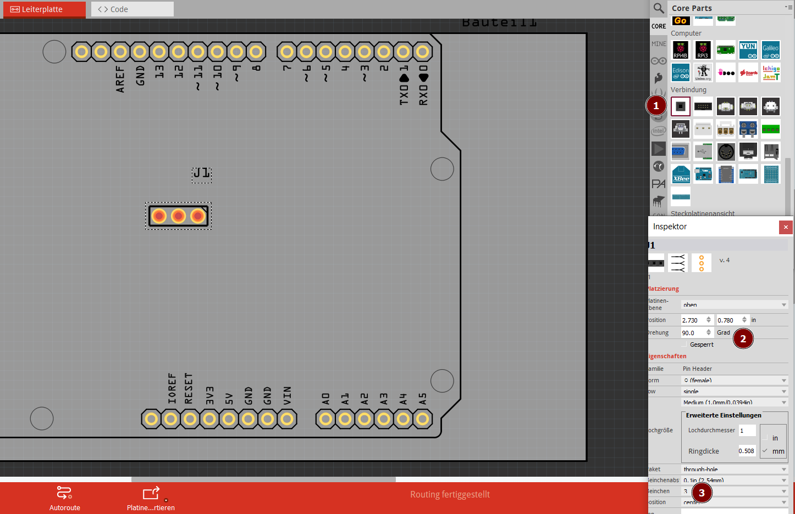
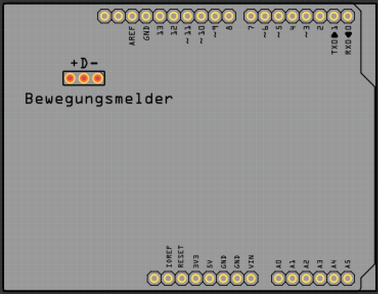
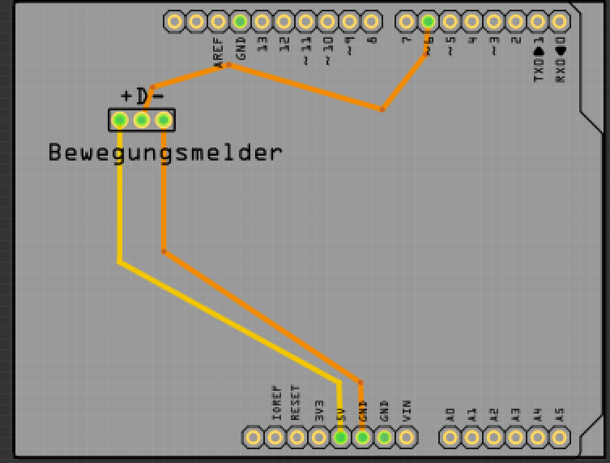
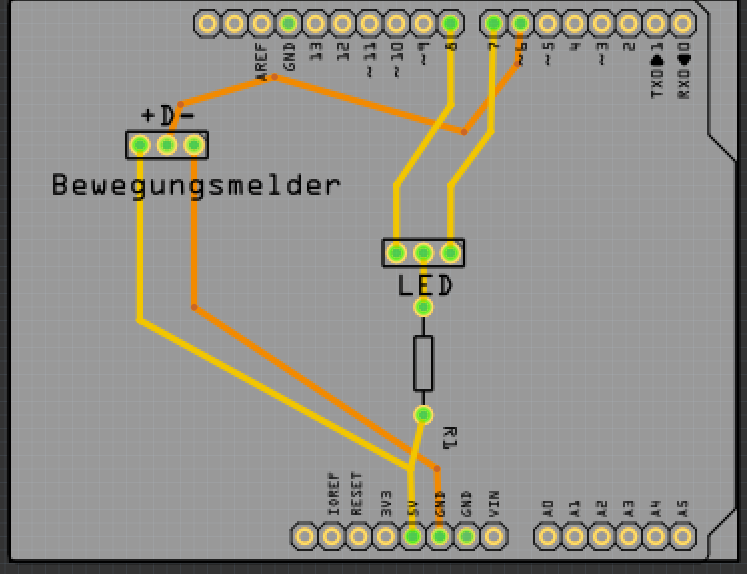
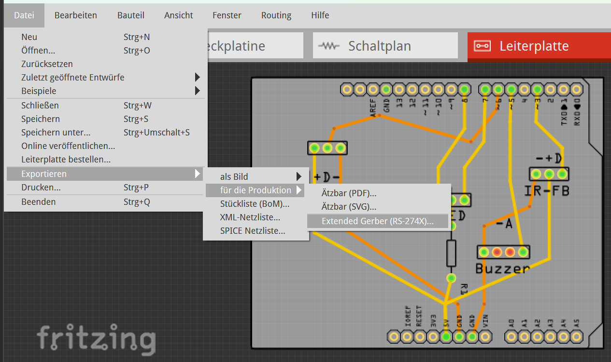

<link rel="stylesheet" href="https://hi2272.github.io/StyleMD.css">

# Leiterplatten-Design mit Fritzing
Für unsere Alarmanlage entwickeln wir ein Shield, das direkt auf den Arduino Uno aufgesteckt werden kann und Anschlüsse für alle Bauteile enthält.

## Entwurf in der Leiterplatten Ansicht.
### Arduino Uno
Ziehe einen Arduino UNO auf die Arbeitsfläche:  

  

Wenn wir die Platine später herstellen lassen, werden 
- die Beschriftungen aufgedruckt
- die Kontakte als Löcher gebohrt.
### Anschlüsse für Bewegungsmelder
1.  Ziehe aus dem **Anschlüsse**-Bereich einen **Generic female Header** auf den Arduino
2.  Stelle im Inspektor ein, dass er um 90° gedreht ist
3.  und 3 Pins hat:  
  
### Beschriftung
1. Schalte im Menü **Bauteil** den Punkt **Bauteilbeschriftung anzeigen** aus.
2. Ziehe aus dem **Leiterplattenansicht**-Bereich einen **text** auf den Arduino
3. Ändere im Inspektor den Text von **logo** auf **Bewegungsmelder**  
  
4.  Füge eine weitere Beschriftung mit **+ D -** hinzu.  
   

### Verdrahtung
1. Ziehe einen Draht von + zu 5V des Arduinos.
2. Ziehe einen Draht von - zu GND.
3. Ziehe einen Draht von D zu 6.
4. Ziehe an den Drähten, so dass sie gute Abstände zu den anderen Kontakten haben.    
**WICHTIG: Rechte Winkel sind auf Leiterplatten nicht erwünscht, da sie beim Ätzen Probleme bereiten.**   

### 2-Farb-LED
1.  Ziehe aus dem **Anschlüsse**-Bereich einen weiteren **Generic female Header** auf den Arduino
2.  Stelle im Inspektor ein, dass er um 90° gedreht ist und 3 Pins hat.
3.  Beschrifte ihn mit **LED**
4.  Ziehe aus dem **Basis**-Bereich einen Widerstand auf den Arduino.
5.  Verbinde den Widerstand mit dem mittleren Pol der LED und 5V.
6.  Verbinde die beiden anderen Pole der LED mit den Pins 7 und 8. 
Hierbei musst du den Draht von D zu Pin 6 kreuzen. Klicke ihn mit der rechten Maustaste an und verschiebe ihn auf die untere Ebene:  
  
### Buzzer
1. Ziehe aus dem **Anschlüsse**-Bereich einen weiteren **Generic female Header** auf den Arduino
2.  Stelle im Inspektor ein, dass er um 90° gedreht ist und 4 Pins hat.  
Wir benötigen später nur die beiden äußeren Pins.
3.  Beschrifte ihn mit **Buzzer**
4.  Beschrifte ihn mit - und A
5.  Schließe - an GND und A an Pin 5 an.

### Fernbedienungssensor
1. Füge einen weiteren 3-Pin-Anschluss für den IR-Sensor hinzu:   

  
### Entwurf speichern
Speichere den Entwurf im Menü **Datei.speichern** als Fritzing-Datei.
### Platine bestellen
#### Aisler
Die Platine kann beim deutshen Hersteller Aisler direkt aus Fritzing heraus bestellt werden.
1. Klicke auf das Menü **Datei.Leiterplatte bestellen**.
2. Wähle **Hochladen zur FAB**
3. Klicke auf **Open in Browser**
4. Klicke dich durch den Bestellprozess.

#### PCBWay
Für den chinesischen Anbieter PCBWay musst du die Platine zuerst als Sammlung von Gerber-Dateien exportieren:

1. Ziehe die graue Leiterplattenfläche so klein, dass sie den Arduino genau überdeckt.
2. Wähle das Menü **Datei.Exportieren.Für die Produktion.Extended Gerber** und speichere die Dateien in einem passenden Ordner.
  
3. Öffne den [Online-Gerber-Viewer](https://www.pcbway.com/project/OnlineGerberViewer.html) von PCBWay
4. Importiere alle Gerber-Dateien, die du vorher exportiert hast.
5. Klicke auf **Get Instant PCB Quote** um die Platinen zu bestellen.

### Lötunterlage erstellen
Für Stiftsockelleisten kann eine Lötvorlage für den 3D-Drucker erstellt werden:

1. Exportiere das Projekt als SVG-Dateien:  
Datei.Exportieren.für die Produktion.Ätzbar(SVG)
2. Öffne eine Datei mit den Borhungen in Inkscape
3. Speichere die Datei im Autocad DXF12-Format (Datei.Speichern unter)
4. Stelle im Speichermenü die Einheit auf mm und die Zeichencodierung auf UTF-8
5. Starte Onshape und erzeuge eine neue Datei.
6. Erzeuge eine neue Skizze auf der Top-Ebene
7. Klicke auf DXF oder DWG einfügen (ggf. musst du das Werkzeug suchen lassen)
8. Importiere die DXF-Datei, die du gerade herunter geladen hast.
9. Extrudiere die Skizze 10 mm hoch.
10. Auf der Lötunterlage können jetzt die Stiftsockelleisten beim Löten aufgesteckt werden.

Um Buchsenleisten zu löten kann ebenfalls dieser Weg beschritten werden. Hier schließen sich weitere Schritte an:
11. Erzeuge eine neue Skizze auf der Oberfläche der Löthilfe
12. Für ungerade Bohrungszahlen:   
- Erstelle einen Dreipunktkreis auf der mittleren Bohrung
- Erstelle ein Mittelpunktrechteck auf dem Mittelpunkt des Kreises mit folgenden Maßen:  
  - n*2.54+1 mm Breite (n=Zahl der Bohrungen)
  - 3 mm Höhe
13. Für gerade Borhungenszahlen:
- Erstelle zwei Dreipunktkreise auf den mittleren beiden Bohrungen
- Erstelle eine Linie zwischen den Mittelpunkten dieser beiden Kreis
- Erstelle das Mittelpunktrechteck auf dem Mittelpunkt dieser Linie.

14. Extrudiere die Skizze als neues Objekt 7 mm hoch.
15. Erstelle auf der Oberfläche eine neue Skizze
16. Erzeuge ein Eckenrechteck auf dem gesamten Objekt
17. Extrudiere dieses Rechteck 3 mm weit.

[zurück](../../index.html)   

---

<footer >

<h5>Haftungsausschluss</h5>
  <h5>Inhalt des Onlineangebotes</h5>
  
Der Autor übernimmt keinerlei Gewähr für die Aktualität, Richtigkeit und Vollständigkeit der bereitgestellten Informationen auf unserer Website. Haftungsansprüche gegen den Autor, welche sich auf Schäden materieller oder ideeller Art beziehen, die durch die Nutzung oder Nichtnutzung der dargebotenen Informationen bzw. durch die Nutzung fehlerhafter und unvollständiger Informationen verursacht wurden, sind grundsätzlich ausgeschlossen, sofern seitens des Autors kein nachweislich vorsätzliches oder grob fahrlässiges Verschulden vorliegt. 
  Alle Angebote sind freibleibend und unverbindlich. Der Autor behält es sich ausdrücklich vor, Teile der Seiten oder das gesamte Angebot ohne gesonderte Ankündigung zu verändern, zu ergänzen, zu löschen oder die Veröffentlichung zeitweise oder endgültig einzustellen.

  <h5>Verweise und Links</h5>
  
Bei direkten oder indirekten Verweisen auf fremde Webseiten (“Hyperlinks”), die außerhalb des Verantwortungsbereiches des Autors liegen, würde eine Haftungsverpflichtung ausschließlich in dem Fall in Kraft treten, in dem der Autor von den Inhalten Kenntnis hat und es ihm technisch möglich und zumutbar wäre, die Nutzung im Falle rechtswidriger Inhalte zu verhindern. 
  Der Autor erklärt hiermit ausdrücklich, dass zum Zeitpunkt der Linksetzung keine illegalen Inhalte auf den zu verlinkenden Seiten erkennbar waren. Auf die aktuelle und zukünftige Gestaltung, die Inhalte oder die Urheberschaft der verlinkten/verknüpften Seiten hat der Autor keinerlei Einfluss. Deshalb distanziert er sich hiermit ausdrücklich von allen Inhalten aller verlinkten /verknüpften Seiten, die nach der Linksetzung verändert wurden. Diese Feststellung gilt für alle innerhalb des eigenen Internetangebotes gesetzten Links und Verweise sowie für Fremdeinträge in vom Autor eingerichteten Gästebüchern, Diskussionsforen, Linkverzeichnissen, Mailinglisten und in allen anderen Formen von Datenbanken, auf deren Inhalt externe Schreibzugriffe möglich sind. Für illegale, fehlerhafte oder unvollständige Inhalte und insbesondere für Schäden, die aus der Nutzung oder Nichtnutzung solcherart dargebotener Informationen entstehen, haftet allein der Anbieter der Seite, auf welche verwiesen wurde, nicht derjenige, der über Links auf die jeweilige Veröffentlichung lediglich verweist.

  <h5>Urheber- und Kennzeichenrecht</h5>
  
Der Autor ist bestrebt, in allen Publikationen die Urheberrechte der verwendeten Bilder, Grafiken, Tondokumente, Videosequenzen und Texte zu beachten, von ihm selbst erstellte Bilder, Grafiken, Tondokumente, Videosequenzen und Texte zu nutzen oder auf lizenzfreie Grafiken, Tondokumente, Videosequenzen und Texte zurückzugreifen. 
  Alle innerhalb des Internetangebotes genannten und ggf. durch Dritte geschützten Marken- und Warenzeichen unterliegen uneingeschränkt den Bestimmungen des jeweils gültigen Kennzeichenrechts und den Besitzrechten der jeweiligen eingetragenen Eigentümer. Allein aufgrund der bloßen Nennung ist nicht der Schluss zu ziehen, dass Markenzeichen nicht durch Rechte Dritter geschützt sind! 
  Das Copyright für veröffentlichte, vom Autor selbst erstellte Objekte bleibt allein beim Autor der Seiten. Eine Vervielfältigung oder Verwendung solcher Grafiken, Tondokumente, Videosequenzen und Texte in anderen elektronischen oder gedruckten Publikationen ist ohne ausdrückliche Zustimmung des Autors nicht gestattet.

Quelle: <a href="http://www.haftungsausschluss-vorlage.de/">Haftungsausschluss Muster</a> von <a href="http://www.haftungsausschluss.org/">Haftungsausschluss.org</a> und das <a href="http://www.dsgvo-gesetz.de/">Datenschutzgesetz</a>

</footer>

