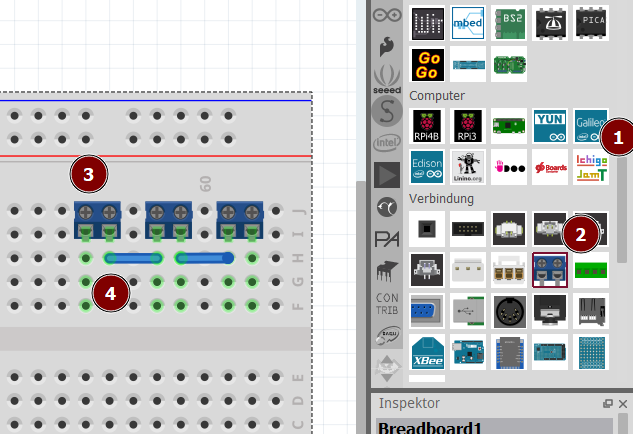
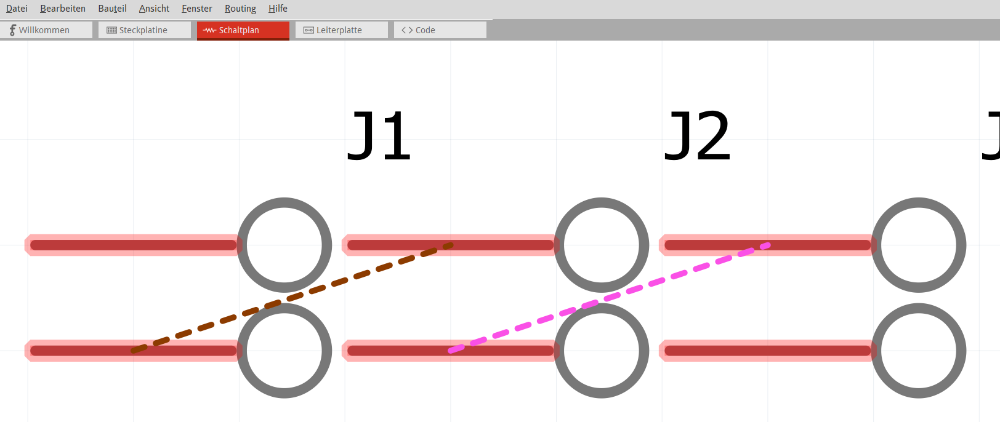
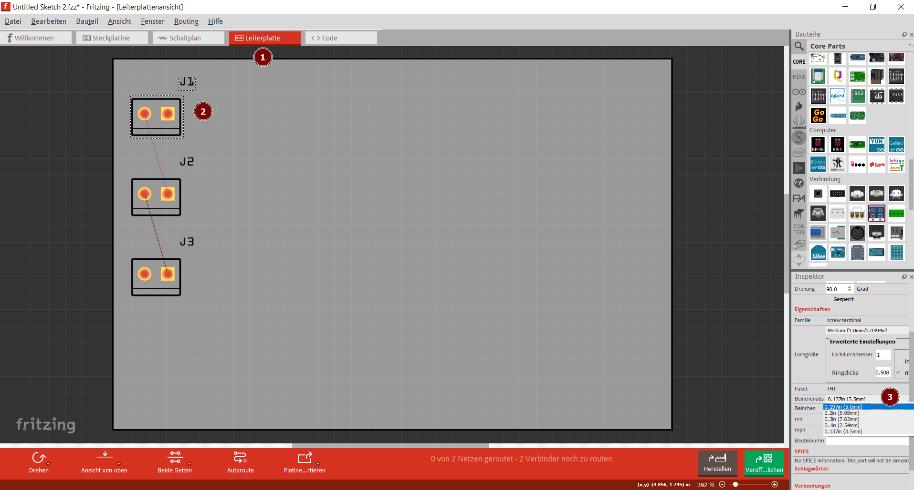

<link rel="stylesheet" href="https://hi2272.github.io/StyleMD.css">

# Leiterplatten-Design mit Fritzing
Wir entwickeln eine einfache Leiterplatte, mit der zwei Batteriekästen hintereinandergeschaltet werden können.
## Entwurf auf dem virtuellen Steckbrett
  
1. Scrolle in den Bauteilen bis zur Rubrik **Verbindung** herunter.
2. Wähle einen Schraubverbinder und ziehe ihn auf das Steckbrett.
3. Füge zwei weitere Verbinder hinzu - du kannst auch mit *copy-paste* arbeiten (Strg C, Strg V).
4. Verbinde die Anschlüsse mit Kabeln, die du aus den Steckrett-Anschlüssen zur Seite ziehst.

## Kontrolle in der Schaltplan-Ansicht
Überprüfe, ob die Verbindungen passen:  

## Design der Leiterplatte
  
1. Wechsele in die Leiterplatten-Ansicht:  
2. Markiere einen Schraubverbinder
3. Überprüfe, on der passender Beinchenabstand eingestellt ist: 5 mm
4. Wähle im Menü *Bauteil* den Punkt *Bauteilbeschriftung ausblenden*.
5. Wiederhole dies für alle Schraubverbinder.  
 (Mit gedrückter Strg-Taste kannst du auch mehrere gleichzeitg markieren.) 

# Herstellen der PCB-Platinen
## [PCBs auf CNC fräsen](CNC/index.html)  
## [PCBs bestellen](PCBBestellen/index.html)

