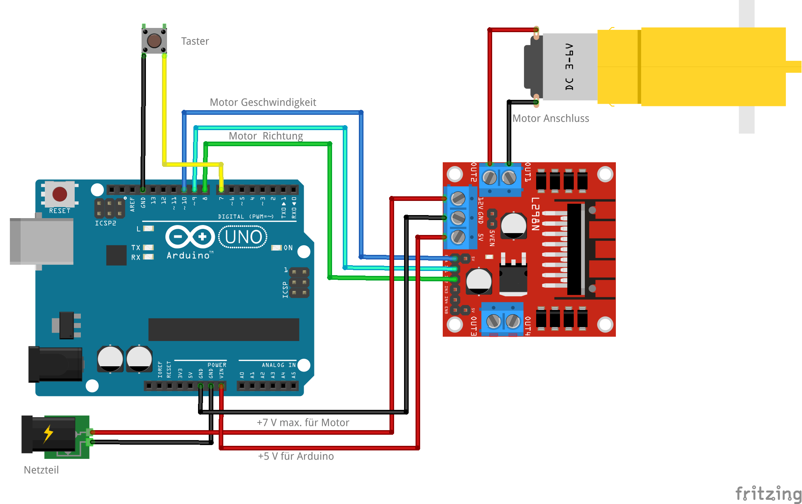

<link rel="stylesheet" href="https://hi2272.github.io/StyleMD.css">

# Kugelbahn
## Allgemeines
Die Firma Bambu Labs stellt auf ihrer Homepage die Druckvorlage für diese Kugelbahn zum Download zur Verfügung: [Marble Run V3](https://makerworld.com/en/models/14265#profileId-14275)  
Wir haben das Modell ausgedruckt und im Schaukasten aufgebaut. Durch einen Druck auf den Taster startet der Motor für den Kugel-Lift:  


Das Modell wird mit folgender Schaltung gesteuert:    



Der enstprechende Programmsketch ist relativ kurz:  
```C++
/*
Deklaration und Initialisierung der Variablen
*/

int motor = 10;  // Motor-Pin zur Geschwindigkeiteinstellung
int in1 = 9;     // Motor-Pins zur Richtungseinstellung
int in2 = 8;
int taster = 7;  // Taster-Pin
int zeit = 0;    // Zeitvariable

/* 
Setup wird einmalig beim Start ausgeführt
*/
void setup() {
  pinMode(motor, OUTPUT);   // Motor ist ein Ausgangs-Pin
  analogWrite(motor, 100);  // Geschwindigkeit: 100 von max. 255 Stufen

  pinMode(in1, OUTPUT);  // Motor-Pins sind Ausgänge
  pinMode(in2, OUTPUT);
  pinMode(taster, INPUT_PULLUP);  // Taster-Pin ist ein Eingang,
                                  // der automatisch auf HIGH gezogen wird.
}

/*
loop wird immer wieder ausgeführt
*/
void loop() {
  if (digitalRead(taster) == LOW) {       // Wenn der Taster gedrückt ist,
    zeit = 15000;                         // dann soll der Motor 15000 ms = 15 Sekunden laufen
    while (digitalRead(taster) == LOW) {  // Warte, bis der Taster losgelassen wurde
      delay(1);
    }
  }
  if (zeit > 0) {             // Wenn noch Laufzeit übrig ist,
    digitalWrite(in1, HIGH);  // dann soll der Motor laufen
    digitalWrite(in2, LOW);
    zeit = zeit - 1;         // und die Zeit nach unten gezählt werden
  } else {                   // sonst
    digitalWrite(in1, LOW);  // soll der Motor stoppen
    digitalWrite(in2, LOW);
  }
  delay(1);  // 1 ms Pause zwischen den loop-Runden
}
```


[zurück](../index.html)