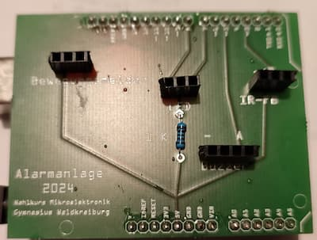

<link rel="stylesheet" href="https://hi2272.github.io/StyleMD.css">

# Alarmanlage
  
1. Befestige auf der Unterseite die Stiftleisten, um die Platine auf den Arduino Uno aufstecken zu können.
2. Löte den 1 kOhm-Widerstand ein.
3. Löte Buchsenleisten für die vier Bauteile ein, die aufgesteckt werden sollen.

[zurück](index.html)   
