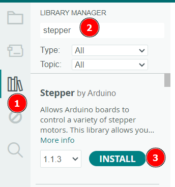

<link rel="stylesheet" href="https://hi2272.github.io/StyleMD.css">

# Schrittmotoren (Stepper-Motoren) 
## 1. Grundlegende Eigenschaften 
Schrittmotoren drehen sich in winzigen Schritten. Bei unserem Modell ist eine 360°-Umdrehung in 2048 Schritte unterteilt. Pro Schritt dreht sich der Motor also um 360°/2048 = 0,175°. Damit sind sehr feine Bewegungen möglich.  
Schrittmotoren werden zum Beispiel in 3D-Druckern verwendet.

## 2. Bestandteile

Schrittmotoren enthalten im Gehäuse stets ein Getriebe, durch dass die Bewegung des Motors verlangsamt und sein Drehmoment erhöht wird. Grundsätzlich haben auch kleine Schrittmotoren ein hohes Drehmoment.


## 3. Verkabelung

Der Schrittmotor wird mit einem speziellen Kabel an das Steuermodul angeschlossen. 

Dieses Steuermodul wird mit dem Arduino verbunden:
- GND: GND
- VCC: +5V
- IN1: Pin 6 
- IN2: Pin 5
- IN3: Pin 4
- IN4: Pin 3
  
Über GND und VCC erhält das Modul die Betriebsspannung. Mit dieser Spannung wird auch der Motor versorgt.

Über IN1-IN4 werden die Steuersignale an das Modul gesendet.  

## 4. Programmierung
### 4.1 Installation der Stepper-Bibliothek
Für die Programmierung des Schrittmotors benötigen wir wieder eine Bibliothek:  

1. Aktiviere den Bibliotheksmanager
2. Tippe den Suchbegriff "Stepper" ein.
3. Installiere die Stepper-Bibliothek von Arduino.

### 4.2 Einfaches Rotations-Programm

Mit dem folgenden Programm dreht der Servo einmal langsam um 180° und anschließend wieder zurück.
```C++
#include <Stepper.h> // Einbinden der Bibliothek.
int SPU = 2048; // 2048 Schritte pro 360° Umdrehung
Stepper motor(SPU, 3,5,4,6); // Ein Motor-Objekt wird an den Pins 3,5,4 und 6 angeschlossen

void setup() 
{
Motor.setSpeed(5); // Geschwindigkeit: 5 Umdrehungen pro Minute
}

void loop() {
Motor.step(2048); // 2048 Schritte = 360°
delay(1000); // 1 Sek. Pause
Motor.step(-2048); // 360° rückwärts
delay(1000); // 1 Sek. Pause
}

```

### Anpassungen

Ändere das Programm ab, so dass
   1. der Motor nur noch 90° weit dreht.
   2. der Motor doppelt so schnell dreht, also mit 10 Umdrehungen pro Minute.
   3. der Motor einen Sekundenzeiger antreibt, sich also jede Sekunde um 6° dreht.   
   Berechne hierzu die nötige Schrittzahl: 360° ≙ 2048 Schritte ⇒ 6° = 2048/60 = 34 Schritte. 


---

<footer >

Die Schaltpläne sind mit <a href="https://www.tinkercad.com/dashboard">Tinkercad</a> erstellt.

<h5>Haftungsausschluss</h5>
  <h5>Inhalt des Onlineangebotes</h5>
  <p>Der Autor übernimmt keinerlei Gewähr für die Aktualität, Richtigkeit und Vollständigkeit der bereitgestellten Informationen auf unserer Website. Haftungsansprüche gegen den Autor, welche sich auf Schäden materieller oder ideeller Art beziehen, die durch die Nutzung oder Nichtnutzung der dargebotenen Informationen bzw. durch die Nutzung fehlerhafter und unvollständiger Informationen verursacht wurden, sind grundsätzlich ausgeschlossen, sofern seitens des Autors kein nachweislich vorsätzliches oder grob fahrlässiges Verschulden vorliegt.<br>
  Alle Angebote sind freibleibend und unverbindlich. Der Autor behält es sich ausdrücklich vor, Teile der Seiten oder das gesamte Angebot ohne gesonderte Ankündigung zu verändern, zu ergänzen, zu löschen oder die Veröffentlichung zeitweise oder endgültig einzustellen.</p>
  <h5>Verweise und Links</h5>
  <p>Bei direkten oder indirekten Verweisen auf fremde Webseiten (“Hyperlinks”), die außerhalb des Verantwortungsbereiches des Autors liegen, würde eine Haftungsverpflichtung ausschließlich in dem Fall in Kraft treten, in dem der Autor von den Inhalten Kenntnis hat und es ihm technisch möglich und zumutbar wäre, die Nutzung im Falle rechtswidriger Inhalte zu verhindern.<br>
  Der Autor erklärt hiermit ausdrücklich, dass zum Zeitpunkt der Linksetzung keine illegalen Inhalte auf den zu verlinkenden Seiten erkennbar waren. Auf die aktuelle und zukünftige Gestaltung, die Inhalte oder die Urheberschaft der verlinkten/verknüpften Seiten hat der Autor keinerlei Einfluss. Deshalb distanziert er sich hiermit ausdrücklich von allen Inhalten aller verlinkten /verknüpften Seiten, die nach der Linksetzung verändert wurden. Diese Feststellung gilt für alle innerhalb des eigenen Internetangebotes gesetzten Links und Verweise sowie für Fremdeinträge in vom Autor eingerichteten Gästebüchern, Diskussionsforen, Linkverzeichnissen, Mailinglisten und in allen anderen Formen von Datenbanken, auf deren Inhalt externe Schreibzugriffe möglich sind. Für illegale, fehlerhafte oder unvollständige Inhalte und insbesondere für Schäden, die aus der Nutzung oder Nichtnutzung solcherart dargebotener Informationen entstehen, haftet allein der Anbieter der Seite, auf welche verwiesen wurde, nicht derjenige, der über Links auf die jeweilige Veröffentlichung lediglich verweist.</p>
  <h5>Urheber- und Kennzeichenrecht</h5>
  <p>Der Autor ist bestrebt, in allen Publikationen die Urheberrechte der verwendeten Bilder, Grafiken, Tondokumente, Videosequenzen und Texte zu beachten, von ihm selbst erstellte Bilder, Grafiken, Tondokumente, Videosequenzen und Texte zu nutzen oder auf lizenzfreie Grafiken, Tondokumente, Videosequenzen und Texte zurückzugreifen.<br>
  Alle innerhalb des Internetangebotes genannten und ggf. durch Dritte geschützten Marken- und Warenzeichen unterliegen uneingeschränkt den Bestimmungen des jeweils gültigen Kennzeichenrechts und den Besitzrechten der jeweiligen eingetragenen Eigentümer. Allein aufgrund der bloßen Nennung ist nicht der Schluss zu ziehen, dass Markenzeichen nicht durch Rechte Dritter geschützt sind!<br>
  Das Copyright für veröffentlichte, vom Autor selbst erstellte Objekte bleibt allein beim Autor der Seiten. Eine Vervielfältigung oder Verwendung solcher Grafiken, Tondokumente, Videosequenzen und Texte in anderen elektronischen oder gedruckten Publikationen ist ohne ausdrückliche Zustimmung des Autors nicht gestattet.</p>

Quelle: <a href="http://www.haftungsausschluss-vorlage.de/">Haftungsausschluss Muster</a> von <a href="http://www.haftungsausschluss.org/">Haftungsausschluss.org</a> und das <a href="http://www.dsgvo-gesetz.de/">Datenschutzgesetz</a>

</footer>
