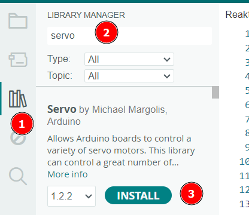

<link rel="stylesheet" href="https://hi2272.github.io/StyleMD.css">

# Servo-Motoren 
## 1. Grundlegende Eigenschaften 
Servo-Motoren (kurz: Servos) sind typische Bauteile im Flugzeugmodellbau. Sie haben folgende Eigenschaften:
- Die Drehung ist nur in einem **eingeschränkten Winkelbereich** von 0° - 180° möglich.  
- Der Servo kann den aktuellen Drehwinkel messen und gezielt einen anderen Winkel anfahren.
- Ein Servomotor kann **nicht vollständig rotieren** und eignet sich nicht zum Antrieb von Rädern.
- Die Drehung erfolgt mit einem hohen Drehmoment, d.h. der Motor kann **große Kraft** entfalten.
## 2. Bestandteile
Ein Servo enthält folgende Bauteile
- Der **Elektromotor** dreht sich mit hoher Drehzahl aber geringem Drehmoment, d.h. er erzeugt eine geringen Kraft.
- Das **Getriebe** verringert die Drehzahl und erhöht das Drehmoment der Bewegung.
- Das **Potentiometer** ist ein Drehwiderstand. Mit ihm kann der Servo messen, in welcher Position der Servomotor steht.

Ein Servomotor benötigt immer eine Steuereinheit, die ihm ein Positionssignal sendet. In unserem Fall ist dies der Arduino. Sobald dieses Positionssignal nicht mit der aktuellen Position des Servos übereinstimmt, dreht sich der Servo.  
Die Funktion eines Servos wird auf dieser Internetseite sehr gut beschrieben: https://www.electronicsplanet.ch/Roboter/Servo/servo-funktionsweise/servo-funktionsweise.php  

## 3. Verkabelung
Servos werden immer mit drei Kabeln angeschlossen:
- braun -> GND
- rot -> +5 V
- orange -> Pin 2

Über das rote und braune Kabel bezieht der Elektromotor im Servo die Spannung, um sich zu bewegen.

**ACHTUNG:** Der Arduino UNO liefert genug Strom, um einen kleinen Servomotor zu betreiben.  
Sollen mehrere oder größere Servos angeschlossen werden, muss die Spannung von einer externen Spannungsquelle bezogen werden.  

## 4. Programmierung
### 4.1 Installation der Servo-Bibliothek
Für die Programmierung des Servos benötigen wir wieder eine Bibliothek:  
  
1. Aktiviere den Bibliotheksmanager
2. Tippe den Suchbegriff "Servo" ein.
3. Installiere die Servo-Bibliothek von Michael Margolis  
### 4.2 Einfaches Rotations-Programm

Mit dem folgenden Programm dreht der Servo einmal langsam um 180° und anschließend wieder zurück.
```C++

#include <Servo.h>  // Bindet die Servo-Bib. ein

Servo myservo;  // Erzeugt ein Servo-Objekt

void setup() {
  myservo.attach(2);  // Servo ist an Pin 2 angeschlossen
}

void loop() {
  for (int pos = 0; pos <= 180; pos=pos+1) { // von 0 bis 180 °
    myservo.write(pos); // dreht Servo auf pos °
    delay(15); // 15 ms Pause, damit der Servo die Position erreicht.
  }
  for (int pos = 180; pos >= 0; pos=pos-1) { // von 180 bis 0° zurück
    myservo.write(pos); 
    delay(15); 
  }
}
```
### Anpassungen

Ändere das Programm ab, so dass
   1. der Servo nur noch 90° weit dreht.
   2. sich der Servo doppelt so schnell dreht, d.h. pro Schritt eine Drehung um 2° durchführt.
   3. der Servo mit einem einzigen Schritt von 0 auf 180° dreht und wieder zurück.   
   Ermittele die Zeit, die als Pause eingelegt werden muss, damit die Drehung jeweils vollständig durchgeführt wird.


---

<footer >

Die Schaltpläne sind mit <a href="https://www.tinkercad.com/dashboard">Tinkercad</a> erstellt.

<h5>Haftungsausschluss</h5>
  <h5>Inhalt des Onlineangebotes</h5>
  <p>Der Autor übernimmt keinerlei Gewähr für die Aktualität, Richtigkeit und Vollständigkeit der bereitgestellten Informationen auf unserer Website. Haftungsansprüche gegen den Autor, welche sich auf Schäden materieller oder ideeller Art beziehen, die durch die Nutzung oder Nichtnutzung der dargebotenen Informationen bzw. durch die Nutzung fehlerhafter und unvollständiger Informationen verursacht wurden, sind grundsätzlich ausgeschlossen, sofern seitens des Autors kein nachweislich vorsätzliches oder grob fahrlässiges Verschulden vorliegt.<br>
  Alle Angebote sind freibleibend und unverbindlich. Der Autor behält es sich ausdrücklich vor, Teile der Seiten oder das gesamte Angebot ohne gesonderte Ankündigung zu verändern, zu ergänzen, zu löschen oder die Veröffentlichung zeitweise oder endgültig einzustellen.</p>
  <h5>Verweise und Links</h5>
  <p>Bei direkten oder indirekten Verweisen auf fremde Webseiten (“Hyperlinks”), die außerhalb des Verantwortungsbereiches des Autors liegen, würde eine Haftungsverpflichtung ausschließlich in dem Fall in Kraft treten, in dem der Autor von den Inhalten Kenntnis hat und es ihm technisch möglich und zumutbar wäre, die Nutzung im Falle rechtswidriger Inhalte zu verhindern.<br>
  Der Autor erklärt hiermit ausdrücklich, dass zum Zeitpunkt der Linksetzung keine illegalen Inhalte auf den zu verlinkenden Seiten erkennbar waren. Auf die aktuelle und zukünftige Gestaltung, die Inhalte oder die Urheberschaft der verlinkten/verknüpften Seiten hat der Autor keinerlei Einfluss. Deshalb distanziert er sich hiermit ausdrücklich von allen Inhalten aller verlinkten /verknüpften Seiten, die nach der Linksetzung verändert wurden. Diese Feststellung gilt für alle innerhalb des eigenen Internetangebotes gesetzten Links und Verweise sowie für Fremdeinträge in vom Autor eingerichteten Gästebüchern, Diskussionsforen, Linkverzeichnissen, Mailinglisten und in allen anderen Formen von Datenbanken, auf deren Inhalt externe Schreibzugriffe möglich sind. Für illegale, fehlerhafte oder unvollständige Inhalte und insbesondere für Schäden, die aus der Nutzung oder Nichtnutzung solcherart dargebotener Informationen entstehen, haftet allein der Anbieter der Seite, auf welche verwiesen wurde, nicht derjenige, der über Links auf die jeweilige Veröffentlichung lediglich verweist.</p>
  <h5>Urheber- und Kennzeichenrecht</h5>
  <p>Der Autor ist bestrebt, in allen Publikationen die Urheberrechte der verwendeten Bilder, Grafiken, Tondokumente, Videosequenzen und Texte zu beachten, von ihm selbst erstellte Bilder, Grafiken, Tondokumente, Videosequenzen und Texte zu nutzen oder auf lizenzfreie Grafiken, Tondokumente, Videosequenzen und Texte zurückzugreifen.<br>
  Alle innerhalb des Internetangebotes genannten und ggf. durch Dritte geschützten Marken- und Warenzeichen unterliegen uneingeschränkt den Bestimmungen des jeweils gültigen Kennzeichenrechts und den Besitzrechten der jeweiligen eingetragenen Eigentümer. Allein aufgrund der bloßen Nennung ist nicht der Schluss zu ziehen, dass Markenzeichen nicht durch Rechte Dritter geschützt sind!<br>
  Das Copyright für veröffentlichte, vom Autor selbst erstellte Objekte bleibt allein beim Autor der Seiten. Eine Vervielfältigung oder Verwendung solcher Grafiken, Tondokumente, Videosequenzen und Texte in anderen elektronischen oder gedruckten Publikationen ist ohne ausdrückliche Zustimmung des Autors nicht gestattet.</p>

Quelle: <a href="http://www.haftungsausschluss-vorlage.de/">Haftungsausschluss Muster</a> von <a href="http://www.haftungsausschluss.org/">Haftungsausschluss.org</a> und das <a href="http://www.dsgvo-gesetz.de/">Datenschutzgesetz</a>

</footer>
