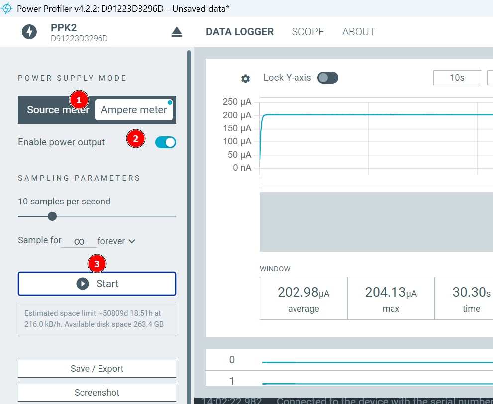

<link rel="stylesheet" href="https://hi2272.github.io/StyleMD.css">

# Messen von Strom und Leistung mit dem Nordic Power Profiler II

## Vorbereitung
Auf dem Rechner muss die Software [nrFConnect](https://www.nordicsemi.com/Products/Development-tools/nRF-Connect-for-Desktop/Download#infotabs) installiert sein. 

Bei Start der Software muss unter **Apps** das Programm **PowerProfiler** installiert und gestartet werden.

## Messen des Stromverbrauchs einer LED
### Verkabelung

Der PowerProfiler wird über USBDataPower an den Rechner angeschlossen.

Die LED wird mit einem Schutzwiderstand an folgende Pole angeschlossen:

- LED + an VOUT
- LED - an Widerstand
- Widerstand an GND rechts von VOUT

### Software-Einstellungen

1. Source-Mode:  
Der PP dient als Spannungsquelle. Über VOUT und GND können maximal 5V Spannung ausgegeben werden.
2. Set Supply Voltage:  
Mit dem Schieberegler kann die ausgegebene Spannung eingestellt werden.
3. Enable Power Output:  
Muss eingeschaltet sein, sonst gibt das System keine Spannung aus.  
4. Zeitskala  
Um glatte Kurven zu erhalten, sollte hier 1 min eingestellt sein.  
5. Start  
Startet die Messung.

Mit diesem Versuch kann gezeigt werden, dass verschieden farbige LEDs unterschiedlich viel Strom benötigen.

## Messung des Stromverbrauchs eines Arduino Unos
### Verkabelung
|PowerProfiler|Arduino|
|----|----|
|VOUT|VIN|
|GND|GND|

Am Arduino können jetzt noch beliebige Verbraucher angeschlossen sein.

### Software Einstellung
s. o.

## Messung des Stromverbrauchs einer an den Arduino angeschlossenen LED
### Verkabelung
- Arduino über USB an Rechner
- LED + an +5V am Arduino
- LED - an Schutzwiderstand
- Schutzwiderstand an VIN am PowerProfiler
- VOUT PowerProfiler an GND am Arduino

### Software Einstellung
  
1. Ampere-Meter  
Wir messen Stromstärke.
2. Enable Power Output  
Auch in diesem Fall muss das System Spannung abgegeben - sonst leuchtet die LED nicht.
3. Start
   
Die gemessene Stromstärke ist in diesem Fall deutlich geringer als beim direkten Anschluss der LED an den Powerprofiler.

## Messen des Stromverbrauchs eine Mikrocontrollers an einem Akku

### Verkabelun
- Akku + auf VIN am PowerProfiler
- VOUT am Powerprofiler auf VIN am Mikrocontroller
- GND am Mikrocontroller auf - am Akku
  
### Software Einstellung
s.o.

