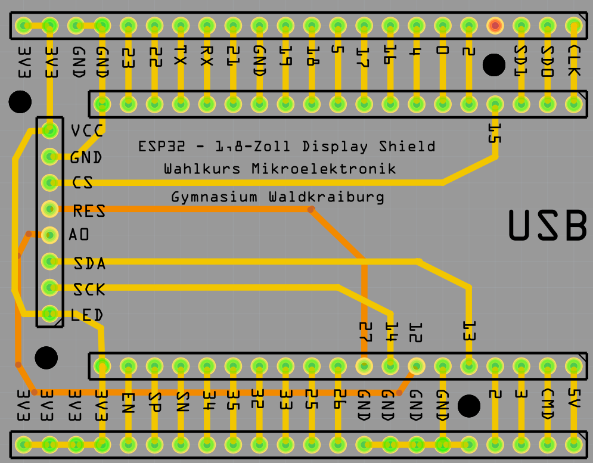

<link rel="stylesheet" href="https://hi2272.github.io/StyleMD.css">

# 1,8 Zoll Display am ESP32

## Anschluss

Das Display kann direkt auf unser Shield aufgesteckt werden:  

  

Du kannst die Pins aber auch direkt mit Dupont-Kabeln verbinden.

[Fritzing Datei Shield](DisplayPCB.fzz)  

## Sketch

Der Beispielsketch zählt die Zahlen von 0 bis 255 hoch:  

```C++
#include <SPI.h>
#include <Adafruit_GFX.h>     // Core graphics library
#include <Adafruit_ST7735.h>  // Hardware-specific library for ST7735

// Das sind die Pins für den HSPI Kanal. Der TFT_RST kann beliebig gewählt werden.

#define TFT_CS 15
#define TFT_MOSI 13  //Der Pin ist auf dem Board mit SDA beschriftet
#define TFT_MISO 12  //Der Pin ist auf dem Board mit A0 beschriftet
#define TFT_RST 27   //Der Pin ist auf dem Board mit RESET beschriftet
#define TFT_CLK 14   //Der Pin ist auf dem Board mit SCK beschriftet

Adafruit_ST7735 tft = Adafruit_ST7735(TFT_CS, TFT_MISO, TFT_MOSI, TFT_CLK, TFT_RST);

void setup() {
  Serial.begin(115200);
  tft.initR(INITR_BLACKTAB);     // den ST7735S Chip initialisieen, schwarz
  tft.fillScreen(ST77XX_BLACK);  // und den Schirm mit Schwarz füllen
  tft.setTextWrap(false);        // automatischen Zeilenumbruch ausschalten
  tft.setTextSize(2);            // Zeichengröße auf 2
  tft.setRotation(1);
  tft.setTextColor(ST77XX_GREEN, ST77XX_BLACK);  // Grüne schrift auf schwarzem Hintergrund

  tft.fillScreen(ST77XX_BLACK);
  tft.setTextSize(8);
}

void loop() {
  for (int zahl = 0; zahl < 255; zahl++) {
    tft.setCursor(12, 35);
    if (zahl < 10) tft.print(" ");
    if (zahl < 100) tft.print(" ");
    tft.print(zahl);
    delay(1000);
  }
}
```

[zurück](../SPI%20Displays/index.html)  
