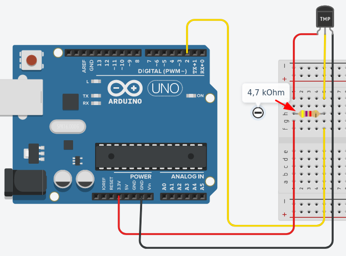
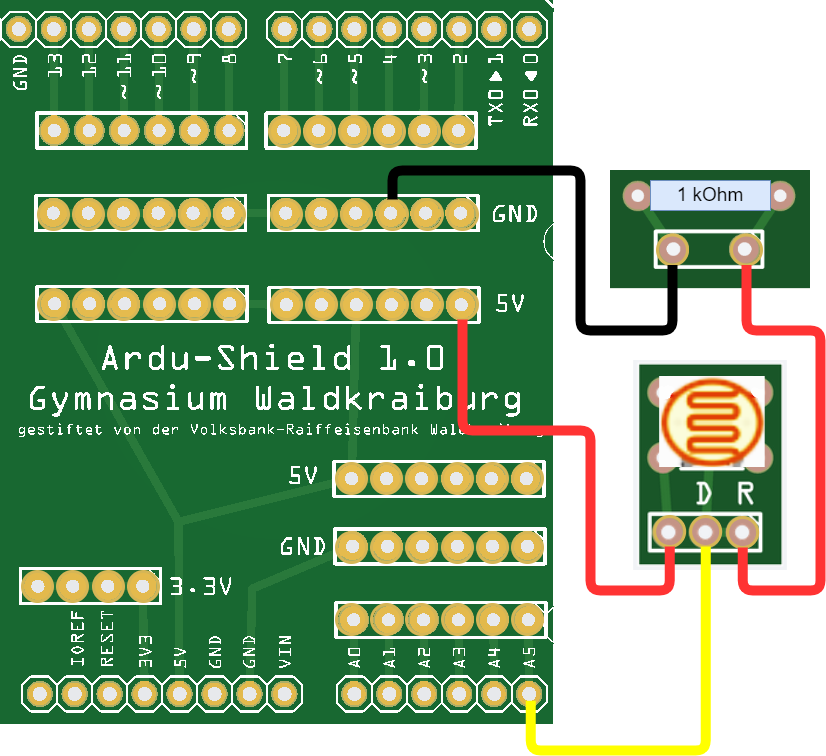

<link rel="stylesheet" href="https://hi2272.github.io/StyleMD.css">

# Wahlunterricht Mikroelektronik und Technik am Gymnasium Waldkraiburg
##### [Stichwortliste](Keywords.html)  
##### [LEDs](#leuchtdioden-leds) | [Taster](#taster) | [Alarmanlage](#alarmanlage) | [Messwerterfassung](#messwerterfassung) | [Diskoleuchte](#diskobeleuchtung) | [ESP32](#esp32) | [Gamepad](#b-ein-bluetooth-gamepad-für-pac-man) | [Interrupts](#blinken-ohne-pause---interrupts) | [3DDruck](#3d-druck-und-cad) | [Motoren](#selbstfahrender-roboter)

##### Diese Seite befindet sich im Aufbau. 
## Grundausstattung

Die Materialien für den Kurs wurden durch Spenden folgender Organisationen finanziert:  

- [Förderverein des Gymnasium Waldkraiburgs](https://www.gymnasiumwaldkraiburg.de/schule/foerderverein/)
- [Wilhelm-Stemmer-Stiftung](https://www.wilhelm-stemmer-stiftung.de)
- [meine Volksbank Raiffeisenbank eG Waldkraiburg](https://www.vb-rb.de/ihre-bank/gs-ansprechpartner/uebersicht-geschaeftsstellen/waldkraiburg.html)  
  
Wir danken den Spendern herzlich für ihre Unterstützung.

[Materialliste](00Material/index.html)  
[Bezugsquellen](00Material/bezugsquellen.html)  

## Dupont-Kabel crimpen
[Dupont-Kabel](DupontKabel/index.html)

## 3D-Druck und CAD
[3D-Druck](003D-Druck/index.html)  

## Projekte mit dem Calliope mini

[Calliope mini](00Calliope/index.html)  

## Projekte mit dem Arduino Uno und dem ESP32

### Die ersten Schritte

[Start von Linux und Anschließen des Arduinos](00Start/index.html)

[Blink - das erste Programm](00StartBlink/index.html)

### Das Ampel-Modul
- [Ampel Modul](01LEDs/05Ampel/index.html)  

### Leuchtdioden: LEDs
- [Leuchtdioden](01LEDs/01LED/index.html)  
- [Blinkende LEDs](01LEDs/02LEDBlink/index.html)  
- [Lauflicht](01LEDs/03LEDLauflicht/index.html)  
- [LED Modul](01LEDs/04LEDModul/index.html)  
  
### Taster
- [Taster im Stromkreis](11Taster/index.html)  
- [Digitaltaster](11Taster/Digitaltaster.html)  
- [Projekt Reaktionszeit messen](11Taster/Reaktionszeit.html)
- [Digitaltaster und 2-FarbLED](11Taster/DigitalTasterBlinkCode.html)  

### Alarmanlage

Wir bauen eine voll funktionsfähige Alarmanlage, die über eine Fernsteuerung aktiviert werden kann:     
<video controls src="VID_20241115_164923.mp4" title="Title" width=300px></video>  

1. [Bewegungsmelder](02/index.html)
2. [Passiver Buzzer](03/index.html)
3. [Infrarot-Fernbedienung](04/index.html)
4. [Rotations-Encoder](05/index.html)
5. [Platinenentwurf mit Fritzing](Fritzing/Alarmanlage/index.html)  
6. [Hinweise zum Löten](Löten/index.html)  
   

### Messwerterfassung

#### Pulsmessung
[Pulssensor](12Puls/index.html)  

#### Temperaturmessung

Wir bauen ein digitales Thermometer und verwenden es, um Messreihen am Computer aufzuzeichnen.  

1. [Temperatursensor Dallas DS18B20](03Temperatur/index.html)  
   
2. [OLED-Display zur Darstellung der Messwerte](03Temperatur/OLED/index.html)
3. [Grafische Ausgabe am Computer](03Processing/index.html)  
     
4. [Daten über die Serielle Schnittstelle einlesen](03Processing/Serial.html)  
5. [Messwerte als Diagramm am Computer darstellen](03Processing/Grafica.html)  
   
6. [Messwerte ins Internet schicken](07Blynk/index.html)  

#### Helligkeitsmessung

Mit einem Fotowiderstand kann die Helligkeit bestimmt werden.  
[Der Fotowiderstand](05Widerstand/index.html)  

#### Entfernungsmessung

Mit Hilfe eines Ultraschallsensors, der zum Beispiel auch in Einparkhilfen von Autos verbaut ist, messen wir den Abstand zu einem Objekt.  

[Der Ultraschallsensor](06Ultraschall/index.html)
[Mehrere Sensoren: Felder und Schleifen](06Ultraschall/MehrereSensoren.html)

#### Geschwindigkeitsmessung

Wir bauen Lichtschranken, mit denen die Geschwindigkeit von Fahrzeugen gemessen werden können.  

1. Reflexlichtschranke
2. Laserlichtschranke

### Diskobeleuchtung

Wir bauen aus einem Mikrofon, einem Arduino UNO und einer LED-Matrix eine Partylicht,das dem Rhythmus der Musik folgt.  
  
In folgendem Video könnt ihr die Funktion des Lichtes sehen:  [YouTube Video Partylicht](https://youtu.be/V1RZFxpPh4s)  

1. [RGB-LED-Matrix](08LEDMatrix/index.html)
2. [Tonaufnahmen mit einem Mikrofon](08LEDMatrix/mikrofon.html)  
3. [Das Partylicht](08LEDMatrix/Partylicht.html)  

### ESP32

### a) Ein Mikrocontroller im Netzwerk

Der ESP32-Chip kann über ein drahtloses Netzwerk (WLAN) gesteuert werden.Seine Programmierung kann auch über die bekannte Arduino-IDE erfolgen.  

1. [Vorbereitung der Arduino-IDE für den ESP32](05ESP32/01Install/index.html)
2. [Schalten einer LED über einen Internetbrowser](05ESP32/02WLAN/index.html)  
   
3. [Senden und Empfangen von Daten über Bluetooth](05ESP32/03Bluetooth/index.html)
4. [MIT AppInventor und Bluetooth](05ESP32/03bAppInventor/index.html)  
5. [Speichern von Messdaten in einem Google Sheet](05ESP32/DHT22/index.html)  

### b) Ein Bluetooth-Gamepad für Pac Man

1. [Joystick-Modul](05ESP32/04GameController/index.html)
2. [Bluetooth Low Energy (BLE)](05ESP32/04GameController/BLEKeyboard.html)

### Selbstfahrender Roboter

Auf Grundlage des [Scru-Fe-Roboters](https://www.thingiverse.com/thing:780050) von rtheiss bauen wir einen Roboter, der Hindernisse erkennt und ihnen ausweichen kann.

1. [Motoren](Motoren/index.html)  
2. [Ultraschall-Entfernungsmesser](06Ultraschall/index.html)  
3. [Servomotoren](Motoren/Servomotor/index.html)  
   
   
### Große OLED-Displays
[SPI-Displays](<SPI Displays/index.html>)

### Das Relais-Modul  
[Relais](Relaismodul/index.html)  
     
### Der Schaukasten
[Kugelbahn](Kugelbahn/index.html)  
[Binäruhr](BinaerUhr/index.html) 

### Blinken ohne Pause - Interrupts  
[Interrupts](10Interrupts/index.html)  

### Multiplexer 
[Multiplexer](Multiplexer/index.html)  

---

<footer >

Die Schaltpläne sind mit <a href="https://www.tinkercad.com/dashboard">Tinkercad</a> erstellt.

<h5>Haftungsausschluss</h5>
  <h5>Inhalt des Onlineangebotes</h5>
  
Der Autor übernimmt keinerlei Gewähr für die Aktualität, Richtigkeit und Vollständigkeit der bereitgestellten Informationen auf unserer Website. Haftungsansprüche gegen den Autor, welche sich auf Schäden materieller oder ideeller Art beziehen, die durch die Nutzung oder Nichtnutzung der dargebotenen Informationen bzw. durch die Nutzung fehlerhafter und unvollständiger Informationen verursacht wurden, sind grundsätzlich ausgeschlossen, sofern seitens des Autors kein nachweislich vorsätzliches oder grob fahrlässiges Verschulden vorliegt. 
  Alle Angebote sind freibleibend und unverbindlich. Der Autor behält es sich ausdrücklich vor, Teile der Seiten oder das gesamte Angebot ohne gesonderte Ankündigung zu verändern, zu ergänzen, zu löschen oder die Veröffentlichung zeitweise oder endgültig einzustellen.

  <h5>Verweise und Links</h5>
  
Bei direkten oder indirekten Verweisen auf fremde Webseiten (“Hyperlinks”), die außerhalb des Verantwortungsbereiches des Autors liegen, würde eine Haftungsverpflichtung ausschließlich in dem Fall in Kraft treten, in dem der Autor von den Inhalten Kenntnis hat und es ihm technisch möglich und zumutbar wäre, die Nutzung im Falle rechtswidriger Inhalte zu verhindern. 
  Der Autor erklärt hiermit ausdrücklich, dass zum Zeitpunkt der Linksetzung keine illegalen Inhalte auf den zu verlinkenden Seiten erkennbar waren. Auf die aktuelle und zukünftige Gestaltung, die Inhalte oder die Urheberschaft der verlinkten/verknüpften Seiten hat der Autor keinerlei Einfluss. Deshalb distanziert er sich hiermit ausdrücklich von allen Inhalten aller verlinkten /verknüpften Seiten, die nach der Linksetzung verändert wurden. Diese Feststellung gilt für alle innerhalb des eigenen Internetangebotes gesetzten Links und Verweise sowie für Fremdeinträge in vom Autor eingerichteten Gästebüchern, Diskussionsforen, Linkverzeichnissen, Mailinglisten und in allen anderen Formen von Datenbanken, auf deren Inhalt externe Schreibzugriffe möglich sind. Für illegale, fehlerhafte oder unvollständige Inhalte und insbesondere für Schäden, die aus der Nutzung oder Nichtnutzung solcherart dargebotener Informationen entstehen, haftet allein der Anbieter der Seite, auf welche verwiesen wurde, nicht derjenige, der über Links auf die jeweilige Veröffentlichung lediglich verweist.

  <h5>Urheber- und Kennzeichenrecht</h5>
  
Der Autor ist bestrebt, in allen Publikationen die Urheberrechte der verwendeten Bilder, Grafiken, Tondokumente, Videosequenzen und Texte zu beachten, von ihm selbst erstellte Bilder, Grafiken, Tondokumente, Videosequenzen und Texte zu nutzen oder auf lizenzfreie Grafiken, Tondokumente, Videosequenzen und Texte zurückzugreifen. 
  Alle innerhalb des Internetangebotes genannten und ggf. durch Dritte geschützten Marken- und Warenzeichen unterliegen uneingeschränkt den Bestimmungen des jeweils gültigen Kennzeichenrechts und den Besitzrechten der jeweiligen eingetragenen Eigentümer. Allein aufgrund der bloßen Nennung ist nicht der Schluss zu ziehen, dass Markenzeichen nicht durch Rechte Dritter geschützt sind! 
  Das Copyright für veröffentlichte, vom Autor selbst erstellte Objekte bleibt allein beim Autor der Seiten. Eine Vervielfältigung oder Verwendung solcher Grafiken, Tondokumente, Videosequenzen und Texte in anderen elektronischen oder gedruckten Publikationen ist ohne ausdrückliche Zustimmung des Autors nicht gestattet.

Quelle: <a href="http://www.haftungsausschluss-vorlage.de/">Haftungsausschluss Muster</a> von <a href="http://www.haftungsausschluss.org/">Haftungsausschluss.org</a> und das <a href="http://www.dsgvo-gesetz.de/">Datenschutzgesetz</a>

</footer>
