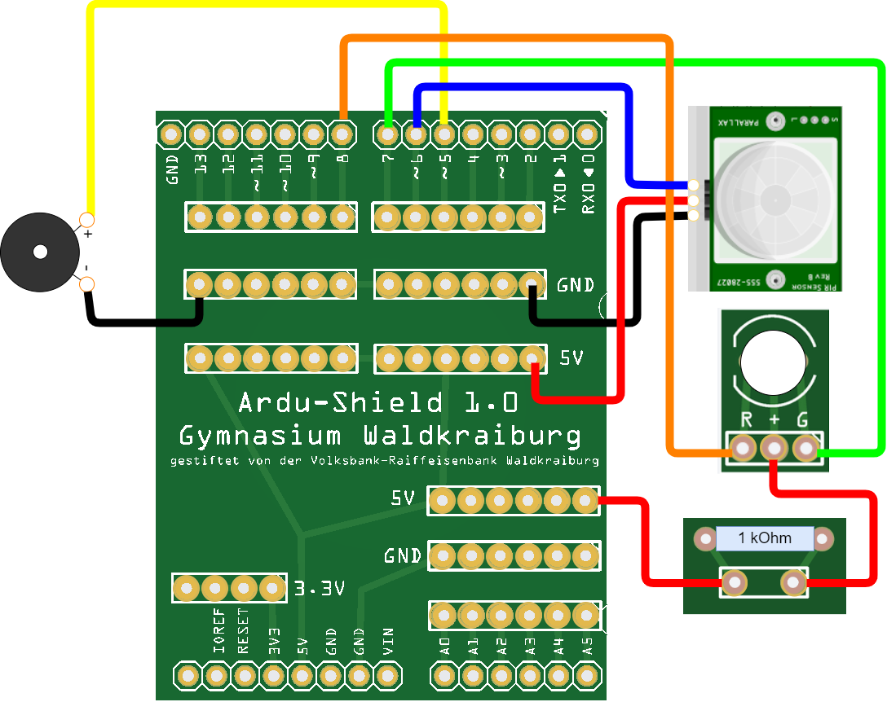

   <link rel="stylesheet" href="https://hi2272.github.io/StyleMD.css">

# Wahlunterricht Mikroelektronik am Gymnasium Waldkraiburg
##### Diese Seite befindet sich im Aufbau. Im Schuljahr 2023/24 werden zu den einzelnen Kapiteln weitere Inhalte hinzugefügt.  

## Grundausstattung 
Die Materialien für den Kurs wurden durch Spenden folgender Organisationen finanziert:  
- [Wilhelm Stemmer Stiftung](https://www.wilhelm-stemmer-stiftung.de)
- [Förderverein des Gymnasium Waldkraiburgs](https://www.gymnasiumwaldkraiburg.de/schule/foerderverein/)  
  
Wir danken den Spendern herzlich für Ihre Unterstützung.  

[Materialliste](00Material/index.html)  

## Projekte
### 1. Die ersten Schritte
[Start von Linux und Anschließen des Arduinos](00Start/index.html)  

[Blink - das erste Programm](00StartBlink/index.html)
### 2. Alarmanlage  
   Wir bauen eine voll funktionsfähige Alarmanlage, die über eine Fernsteuerung aktiviert werden kann.  
   
   1. [Leuchtdioden](01/index.html)
   2. [Bewegungsmelder](02/index.html)
   3. [Passiver Buzzer](03/index.html)
   4. [Infrarot-Fernbedienung](04/index.html)  
   
### 3. Messwerterfassung
#### Temperaturmessung

   Wir bauen ein digitales Thermometer und verwenden es, um Messreihen am Computer aufzuzeichnen.
   1. Thermofühler
   2. OLED-Display zur Darstellung der Messwerte
   3. Graphische Ausgabe am Computer  
#### Geschwindigkeitsmessung
   Wir bauen Lichtschranken, mit denen die Geschwindigkeit von Fahrzeugen gemessen werden können.
   1. Reflexlichtschranke
   2. Laserlichtschranke
       
### 4. Diskobeleuchtung  
 Wir bauen aus einem Mikrofon, einem Arduino UNO und einer LED-Matrix eine Partylicht,das dem Rhythmus der Musik folgt.  
  
In folgendem Video könnt ihr die Funktion des Lichtes sehen:  [YouTube Video Partylicht](https://youtu.be/V1RZFxpPh4s)  
  1. RGB-LEDs
  2. Tonaufnahmen mit einem Mikrofon
### 5. Selbstfahrender Roboter  
   Auf Grundlage des [Scru-Fe-Roboters](https://www.thingiverse.com/thing:780050) von rtheiss bauen wir einen Roboter, der Hindernisse erkennt und ihnen ausweichen kann.  
   1. Motorsteuerung  
   2. Ultraschall-Entfernungsmesser  
   3. Servomotoren  

* * *

<footer >

  Die Schaltpläne sind mit <a href="https://www.tinkercad.com/dashboard">Tinkercad</a> erstellt. 
  <h5>Haftungsausschluss</h5>
  <h5>Inhalt des Onlineangebotes</h5>
  
Der Autor übernimmt keinerlei Gewähr für die Aktualität, Richtigkeit und Vollständigkeit der bereitgestellten Informationen auf unserer Website. Haftungsansprüche gegen den Autor, welche sich auf Schäden materieller oder ideeller Art beziehen, die durch die Nutzung oder Nichtnutzung der dargebotenen Informationen bzw. durch die Nutzung fehlerhafter und unvollständiger Informationen verursacht wurden, sind grundsätzlich ausgeschlossen, sofern seitens des Autors kein nachweislich vorsätzliches oder grob fahrlässiges Verschulden vorliegt. 
  Alle Angebote sind freibleibend und unverbindlich. Der Autor behält es sich ausdrücklich vor, Teile der Seiten oder das gesamte Angebot ohne gesonderte Ankündigung zu verändern, zu ergänzen, zu löschen oder die Veröffentlichung zeitweise oder endgültig einzustellen.

  <h5>Verweise und Links</h5>
  
Bei direkten oder indirekten Verweisen auf fremde Webseiten (“Hyperlinks”), die außerhalb des Verantwortungsbereiches des Autors liegen, würde eine Haftungsverpflichtung ausschließlich in dem Fall in Kraft treten, in dem der Autor von den Inhalten Kenntnis hat und es ihm technisch möglich und zumutbar wäre, die Nutzung im Falle rechtswidriger Inhalte zu verhindern. 
  Der Autor erklärt hiermit ausdrücklich, dass zum Zeitpunkt der Linksetzung keine illegalen Inhalte auf den zu verlinkenden Seiten erkennbar waren. Auf die aktuelle und zukünftige Gestaltung, die Inhalte oder die Urheberschaft der verlinkten/verknüpften Seiten hat der Autor keinerlei Einfluss. Deshalb distanziert er sich hiermit ausdrücklich von allen Inhalten aller verlinkten /verknüpften Seiten, die nach der Linksetzung verändert wurden. Diese Feststellung gilt für alle innerhalb des eigenen Internetangebotes gesetzten Links und Verweise sowie für Fremdeinträge in vom Autor eingerichteten Gästebüchern, Diskussionsforen, Linkverzeichnissen, Mailinglisten und in allen anderen Formen von Datenbanken, auf deren Inhalt externe Schreibzugriffe möglich sind. Für illegale, fehlerhafte oder unvollständige Inhalte und insbesondere für Schäden, die aus der Nutzung oder Nichtnutzung solcherart dargebotener Informationen entstehen, haftet allein der Anbieter der Seite, auf welche verwiesen wurde, nicht derjenige, der über Links auf die jeweilige Veröffentlichung lediglich verweist.

  <h5>Urheber- und Kennzeichenrecht</h5>
  
Der Autor ist bestrebt, in allen Publikationen die Urheberrechte der verwendeten Bilder, Grafiken, Tondokumente, Videosequenzen und Texte zu beachten, von ihm selbst erstellte Bilder, Grafiken, Tondokumente, Videosequenzen und Texte zu nutzen oder auf lizenzfreie Grafiken, Tondokumente, Videosequenzen und Texte zurückzugreifen. 
  Alle innerhalb des Internetangebotes genannten und ggf. durch Dritte geschützten Marken- und Warenzeichen unterliegen uneingeschränkt den Bestimmungen des jeweils gültigen Kennzeichenrechts und den Besitzrechten der jeweiligen eingetragenen Eigentümer. Allein aufgrund der bloßen Nennung ist nicht der Schluss zu ziehen, dass Markenzeichen nicht durch Rechte Dritter geschützt sind! 
  Das Copyright für veröffentlichte, vom Autor selbst erstellte Objekte bleibt allein beim Autor der Seiten. Eine Vervielfältigung oder Verwendung solcher Grafiken, Tondokumente, Videosequenzen und Texte in anderen elektronischen oder gedruckten Publikationen ist ohne ausdrückliche Zustimmung des Autors nicht gestattet.

  
  Quelle: <a href="http://www.haftungsausschluss-vorlage.de/">Haftungsausschluss Muster</a> von <a href="http://www.haftungsausschluss.org/">Haftungsausschluss.org</a> und das <a href="http://www.datenschutzgesetz.de/">Datenschutzgesetz</a>
</footer>
