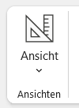
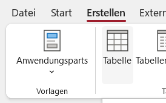
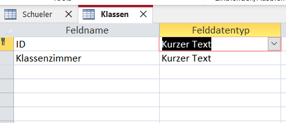
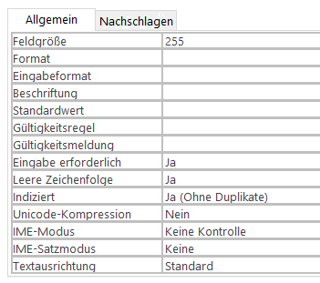
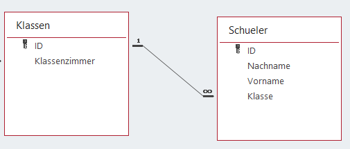
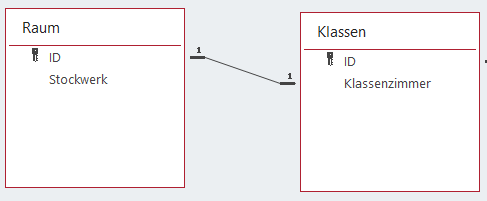
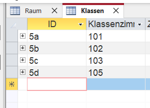
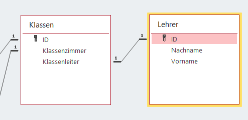
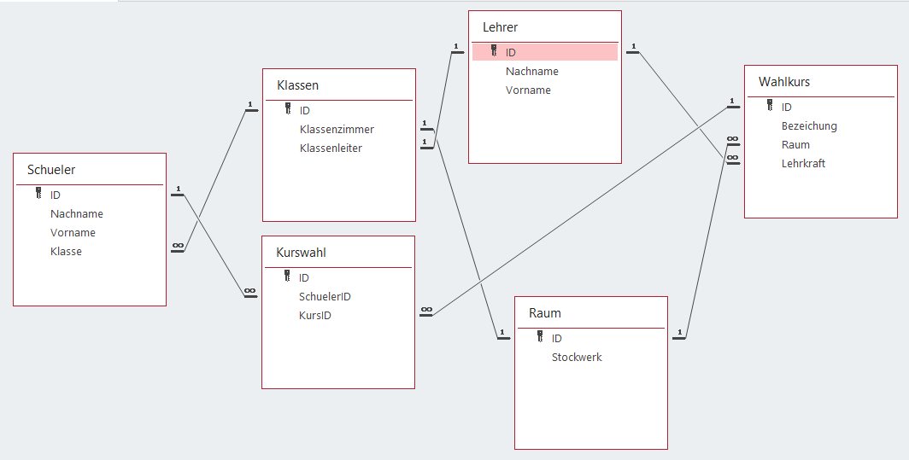

<link rel="stylesheet" href="https://hi2272.github.io/StyleMD.css">

# Datenbank-Design in Access

## Entwurfs- und Eingabemodus
In Access muss grundsätzlich zwischen zwei Bearbeitungsmodi unterschieden werden:  
### Entwurfsmodus
  
schaltet in den Entwurfsmodus um.  
Hier können die Datenbanktabellen gestaltet werden.  
### Eingabemodus
-   
schaltet in den Eingabemodus um.  
Hier werden Daten in die bestehenden Tabellen eingetragen.  
## Erzeugen der Tabelle Schueler
Schalte in den Entwurfsmodus und erzeuge folgende Tabelle:  
  
Speichere die Tabelle unter dem Namen "Schueler". (Evtl. musst du die Tabelle1 mit einem Rechtsklick in Schueler umbenennen.)
 ## Erzeugen der Tabelle Klasse  
 Erzeuge im **Erstellen**-Menü eine neue Tabelle und speichere sie unter dem Namen **Klassen.**  
   
 Trage im Entwurfsmodus folgende Attribute ein:  
   
 Überprüfe, dass für das Attribut ID folgende Feldeigenschaften gelten:  
   
 Damit legen wir ID als Primärschlüssel fest, der aber nicht automatisch erzeugt wird.  
 ## Beziehungen erzeugen
 Schließe alle Tabellen durch eine Rechtsklick auf den Tabellenkopf:  
   
 - Wechsele ins Menü **Datenbanktools** und klicke dort auf Beziehungen:  
   
 - Ziehe beide Tabellen auf die Arbeitsfläche.  
 Beziehungen zwischen den Tabellen werden jetzt erstellt, indem der Primärschlüssel der einen Tabelle auf das passende Attribut der zweiten Tabelle gezogen wird.  
 - Ziehe die **ID** der Tabelle **Klassen** auf das Attribut **Klasse** der Tabelle **Schüler**.
 - Die Kardinalität der Beziehung wird automatisch gesetzt. Da jeder Schüler genau eine Klasse besucht, eine Klasse aber von beliebig vielen Schüler besucht wird, entsteht eine 1:n-Beziehung.  
    
 - Wähle zusätzlich **referentielle Integrität**, damit Access automatisch prüft, ob die Klasse, die in der Tabelle Schüler eingetragen wird, auch tatsächlich existiert:  
    
 - Im Ergebnis wird die Relation korrekt dargestellt:  
  
  ## Die Tabelle Raum
- Erstelle eine Tabelle **Raum** mit folgenden Attributen:  
  
- Ändere die Feldeigenschaften des Attributs **Klassenzimmer** in der Tabelle **Klasse** auf **Indiziert: Ja (Ohne Duplikate)**  
- Erzeuge diese 1:1-Beziehung:  
  
 Da wir bei beiden Attributen keine Duplikate zulassen, erzeugt Access automatisch eine 1:1-Relation.  
 ## Daten eintragen
 Trage in die drei Tabelle in folgender Reihenfolge Werte ein:  
   
   
   
 ## Die Tabelle Lehrer
 Erstelle eine Tabelle Lehrer und binde sie in dein Datenbankschema ein:  
   
 ## Wahlkurse
 Ergänze deine Datenbank um die Tabellen **Wahlkurs** und **Kurswahl**:  
   
 Trage in deine Tabellen in der richtigen Reihenfolge Daten ein, so dass Schüler Wahlkurse belegt haben.  

 
[zurück](../../index.html)  

