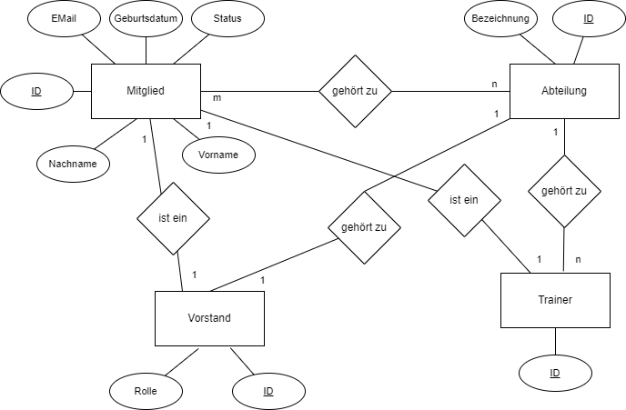

<link rel="stylesheet" href="https://hi2272.github.io/StyleMD.css">

# Datenbank eines Sportvereins

Ein Sportverein besteht aus mehreren Abteilungen, wie Fußball, Handball und Basketball. Jedes Mitglied kann in einer oder mehreren Abteilungen aktiv sein. Die Mitgliedsdaten umfassen grundlegende Informationen wie Name, E-Mail-Adresse oder das Geburtsdatum. Jedes Mitglied erhält eine eindeutige Mitgliedsnummer, und der Status des Mitglieds kann aktiv, passiv oder ausgetreten sein.
Einige Mitglieder sind Trainer, die jeweils einer Abteilung zugeordnet sind oder Vorstände, die die Verwaltung des Vereins übernehmen. Jeder Vorstand hat eine spezifische Rolle innerhalb des Vereins und jede Abteilung hat einen eigenen Vorstand als Leiter. In einer Abteilung kann es mehrere Trainer geben.

## ER-Schema

##  Aufgabenstellung
Setze die Datenbank in Access um.

[Lösung](Access.html)

