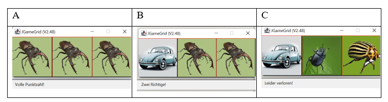

   <link rel="stylesheet" href="https://hi2272.github.io/StyleMD.css">

  

# Glückspiel

Übung zu logischen Funktionen in Java.

  

### Arbeitsmaterialien

[BlueJ-Vorlage](<13d Glückspiel.jar>)   

[Anleitung als pdf](<20 Logische Funktionen.pdf>)

  
 
  
Quellen: <a href='https://www.bluej.org'>BlueJ</a>, <a href='http://www.java-online.ch/gamegrid/gamegridEnglish/index.php?inhalt_links=navigation.inc.php&inhalt_mitte=grundelemente/grid.inc.php'> JGameGrid</a>
  

