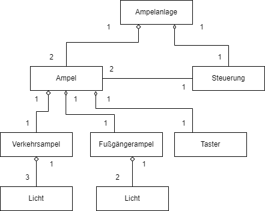

 <meta charset="utf-8" />
  <title>Informatik</title>
  <link rel="stylesheet" href="https://Hi2272.github.io/StyleMD.css">
 
 # Eine Fußgänger-Ampel

## Klassendiagramm

## Sequenz-Diagramm
Erstelle ein Sequenz-Diagramm für den gesamten Vorgang, der durch das Drücken auf einen Taster ausgelöst wird.  
Es genügt hierbei, wenn du eine der beide Ampeln simulierst. Die Schaltzyklen der Verkehrsampeln kannst du mit dem Methode gruenGelbRot() und rotGelbGruen() abkürzen. Pausen müssen nicht simuliert werden.  
Insgesamt benötigst du 4 Objekte.  

[weiter](02Sequenzdiagramm.html)  
