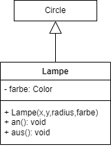

  <meta charset="utf-8" />
  <title>Informatik</title>
  <link rel="stylesheet" href="https://Hi2272.github.io/StyleMD.css">
 
 # Die Klasse Lampe
 Das folgende Klassendiagramm zeigt die Klasse Lampe:  

Programmiere die Klasse **Lampe** in Java. Beachte hierbei folgende Punkte:  

- Die Klasse **Lampe** leitet sich von der Oberklasse **Circle** ab. Das heißt sie erweitert diese Oberklasse und erbt ihre Methode und Attribute. 
- Die Koordinaten des Mittelpunktes (x,y) und der Radius werden nicht als Attribute der Klasse Lampe gespeichert, sondern in der Oberklasse **Circle**. 
- Im Konstruktor der Klasse **Lampe** muss daher als erstes der Konstruktor der Oberklasse aufgerufen werden. Dies geschieht mit dem Schlüsselwort s.....
- Die Parameter x,y und radius werden dabei mitgegeben.
- In der Methode **an** wird über die Methode **setFillColor** die Farbe der Lampe gesetzt.
- In der Methode **aus** wird diese Farbe auf den Wert **Color.black** gesetzt.
  

    2025 Rainer Hille  Unter Verwendung der  <a href='https://www.online-ide.de/'>Online-IDE von Martin Pabst</a> Hinweis: Der Code-Editor muss erst geladen werden. Klicke ggf. auf <b>Code Reset</b> um den Programmcode neu zu laden.

  

  
  <section>
    <iframe
    srcdoc=""
    width="100%" height="600" frameborder="0">
    {'id': 'Java', 'speed': 2000, 
    'withBottomPanel': true ,'withPCode': false ,'withConsole': true ,
    'withFileList': true ,'withErrorList': true}
    
   </iframe>
</section>

| [zurück](../index.html) | [weiter](../04Verkehrsampel.html) | 
| --- | ---- |
