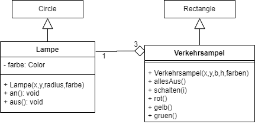

  <meta charset="utf-8" />
  <title>Informatik</title>
  <link rel="stylesheet" href="https://Hi2272.github.io/StyleMD.css">
 
 # Die Klasse Verkehrsampel
 Das folgende Klassendiagramm zeigt die Klasse Verkehrsampel:  

Programmiere die Klasse **Verkehrsampel** in Java. Beachte hierbei folgende Punkte:  

## Attribute:
- Die Aggregation der Lampen wird über ein Feld **lampe** vom Datentyp **Lampe** gespeichert.
## Konstruktor:
- Die x- und die y-Koordinate, die Breite und die Höhe werden als ganzzahlige Parameter übergeben. Die Farben sind ein Feld vom Datentyp **Color**.
- Als erstes muss wieder der Konstruktor der Oberklasse aufgerufen werden. Die Parameter sind x, y, b und h. 
- Als nächstes wird der Hintergrund mit der Methode **setFillColor** auf den Wert **Color.darkcyan** gesetzt.
- Das Feld **lampe** wird mit genauso vielen Elementen initialisiert, wie im Parameter **farben** übergeben werden.
- Die Elemente des Feldes **lampe** werden mit einer Schleife initialisiert. Der Konstruktor-Aufruf kann hier kopiert werden:   
 lampe[i] = new Lampe(x + b/2, y + h / 6 + i * h / 3, h / 10, farbe[i]);

- Zum Abschluss wird für die erste Lampe die Methode **an** aufgerufen.

Dein Programm sollte jetzt keine Fehlermeldung mehr zeigen und kann getestet werden.

## Methode allesAus()
Mit einer Schleife soll für alle Elemente des Feldes **lampe** die Methode **aus** aufgerufen werden.

Teste die Methode durch den Aufruf von **v.allesAus();**
## Methode schalten(int i)
- Aufruf der Methode **allesAus**
- Aufruf der Methode **an** für die Lampe mit dem Index **i**
- 1000 ms = 1 Sekunde Pause durch Aufruf der Methode **SystemTools.pause(1000)**

Teste auch diese Methode mit **v.schalten(1);**   

## Methode wirdRot()
Die Ampel soll von grün über gelb nach rot schalten. Wegen der eingebauten Pausen dauert dieser Vorgang 3 Sekunden. In dieser Zeit soll das Attribut **schaltet** den Wert **true** haben.  

- Weise dem Attribut **schaltet** den Wert **true** zu.
- Rufe in einer Schleife für alle Lampen die Methode **schalten(i)** auf.
- Weise dem Attribut den Wert **false** zu.

## Methode wirdGruen()
Programmiere die analoge Methode um von rot über gelb nach grün zu schalten.

## Methode isSchaltend
Diese Methode entspricht einer **get-Methode** für das Attribut **schaltet**.    
Bei Attributen vom Typ **boolean** nennt man **get-Methoden** häufig **is-Methode**.

    2025 Rainer Hille  Unter Verwendung der  <a href='https://www.online-ide.de/'>Online-IDE von Martin Pabst</a> Hinweis: Der Code-Editor muss erst geladen werden. Klicke ggf. auf <b>Code Reset</b> um den Programmcode neu zu laden.

  

  
  <section>
    <iframe
    srcdoc=""
    width="100%" height="600" frameborder="0">
    {'id': 'Java', 'speed': 2000, 
    'withBottomPanel': true ,'withPCode': false ,'withConsole': true ,
    'withFileList': true ,'withErrorList': true}
    
      
  
   </iframe>
</section>

| [zurück](../index.html) | [weiter](../04Verkehrsampel.html) | 
| --- | ---- |
