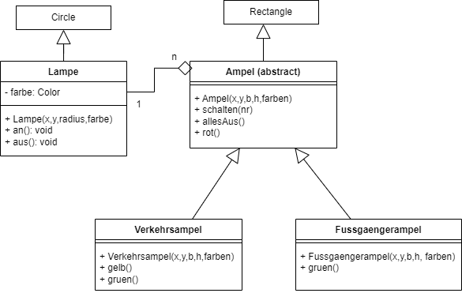

  <meta charset="utf-8" />
  <title>Informatik</title>
  <link rel="stylesheet" href="https://Hi2272.github.io/StyleMD.css">
 
 # Eine abstrakte Ampel
 
 Die Verkehrsampel und die Fußgängerampel haben viele gemeinsame Methoden. Der einzige Unterschied zwischen beiden ist die Anzahl der Lampen.

 Um Code-Duplikation zu vermeiden, setzen wir dieses Klassendiagramm um:  
   
 Die Klasse **Ampel** wird hierbei als **abstrakte Klasse** deklariert. Von einer abstrakten Klasse können keine Objekte erzeugt werden.  

 In der Biologie wäre zum Beispiel die Klasse **Säugetiere** eine abstrakte Klasse. Mensch, Hund oder Pottwal sind Unterklassen dieser abstrakten Oberklasse. Ein Mensch ist ein konkretes Objekt, d.h. eine Instanz der Klasse **Mensch**. Es gibt aber kein konkretes Säugetier. Abstrakte Klassen sind daher allgemein Sammel- oder Oberklassen.  
 In der abstrakten Klasse **Säugetier** werden alle Eigenschaften oder Attribute gesammelt, die typisch für Säugetiere sind. Also zum Beispiel die Tatsache, dass sie ein Fell aus Haaren haben, lebende Nachkommmen gebären und diese mit Milch säugen.   

 Analog können wir alle Attribute und Methoden, die in der Verkehrs- und der Fußgängerampel gemeinsam auftreten in die abstrakte Klasse Ampel auslagern.

1. Mit **public abstract class Ampel** erstellst du eine abstrakte Klasse.
2. Diese muss sich noch von Rectangle ableiten.
3. Kopiere alle Attribute und Methoden aus der Klasse **Verkehrsampel** in die Klasse **Ampel**
4. Ändere den Konstruktor der Klasse **Ampel** so ab, dass er 
   1. den Konstruktor der Oberklasse **Rectangle** aufruft.
   2. Die Hintergrundfarbe setzt.
   3. Das Feld **lampe** initialisiert.
   4. Das Attribut **schaltet** auf **false** setzt.
5. Lösche alle Attribute und Methode außer dem Konstruktor aus der Klasse **Verkehrsampel**.
6. Ändere den Kopf der Klasse so ab, dass sie sich von **Ampel** ableitet.
7. Ändere den Konstruktor so ab, dass er
   1. den Konstruktor der Oberklasse **Ampel** aufruft.
   2. Die Elemente des Feldes **lampe** initialisiert.

Beim Zugriff auf das Feld **lampe** werden jetzt Fehlermeldungen angezeigt. Sie treten auf, weil wir in der Unterklasse versuchen auf ein **private** deklariertes Attribut zuzugreifen.  
Ändere den Zugriffsmodifikator in der Klasse **Ampel** so, dass von der Klasse und ihren Unterklassen auf das Attribut zugegriffen werden kann.

    2025 Rainer Hille  Unter Verwendung der  <a href='https://www.online-ide.de/'>Online-IDE von Martin Pabst</a> Hinweis: Der Code-Editor muss erst geladen werden. Klicke ggf. auf <b>Code Reset</b> um den Programmcode neu zu laden.

  

  
  <section>
    <iframe
    srcdoc=""
    width="100%" height="600" frameborder="0">
    {'id': 'Java', 'speed': 2000, 
    'withBottomPanel': true ,'withPCode': false ,'withConsole': true ,
    'withFileList': true ,'withErrorList': true}
    
      
      
  
   </iframe>
</section>

| [zurück](../index.html) | [weiter](../04Verkehrsampel.html) | 
| --- | ---- |
