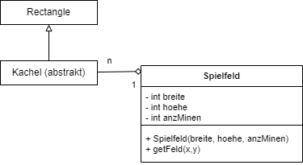

  <meta charset="utf-8" />
  <title>Informatik</title>
  <link rel="stylesheet" href="https://Hi2272.github.io/StyleMD.css">
 
 # Minesweeper
## Klassendiagramm
  
In diesem Klassendiagramm sehen wir ein Beispiel von Polymorphismus.  
Im Feld des Spielfeldes können Minen oder Platten gespeichert werden.   
Beide Klassen leiten sich von der abstrakten Klasse **Kachel** ab, für die das Feld in der Klasse **Spielfeld** deklariert wurde.

## Aufgabenstellung

 

1. Programmiere den Kopf der abstrakten Klasse Kachel.
2. Programmiere die Klasse Spielfeld.
  

  
  <section>
    <iframe
    srcdoc=""
    width="100%" height="600" frameborder="0">
    {'id': 'Java', 'speed': 2000, 
    'withBottomPanel': true ,'withPCode': false ,'withConsole': true ,
    'withFileList': true ,'withErrorList': true}
    
    
    
    
  
  
  </script>
  
   </iframe>
</section>

| [zurück](../index.html) | [weiter](01Klassendiagramm.html) | 
| --- | ---- |
