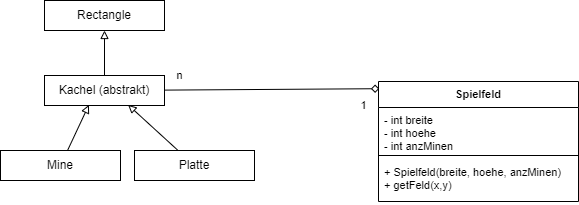
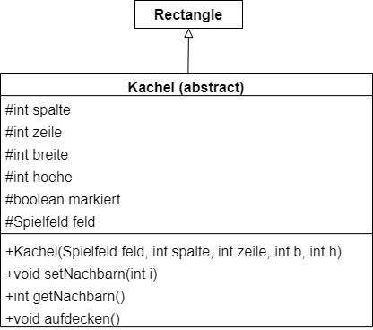
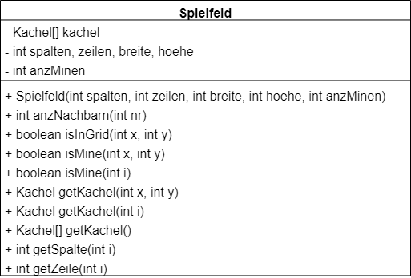

  <meta charset="utf-8" />
  <title>Informatik</title>
  <link rel="stylesheet" href="https://Hi2272.github.io/StyleMD.css">
 
 # Minesweeper
## Klassendiagramm

   
In diesem Klassendiagramm sehen wir ein Beispiel von **Polymorphismus**.  
Im Feld des Spielfeldes können Minen oder Platten gespeichert werden.   
Beide Klassen leiten sich von der abstrakten Klasse **Kachel** ab, für die das Feld in der Klasse **Spielfeld** deklariert wurde.

## Aufgabenstellung

### 1. Programmiere die Klasse Kachel:  
  
### Konstruktor
- Im Konstruktor muss zuerst der Konstruktor der Oberklasse mit diesen Parameter-Werten aufgerufen werden:  
*spalte * b, zeile * h, b, h*   
Hiermit werden die **zeilen** und **spalten**-Angaben in x- und y-Koordinaten umgerechnet.
-  Anschließend müssen die Attribute **spalte, zeile, breite** und **hoehe** initialisiert werden.
-  Das Attribut **markiert** wird mit **false** initialisert.
  
  ### Methoden
  Die Methoden **setNachbarn** und **aufdecken** sollen einen leeren Rumpf haben. Man nennt solche Methoden auch **Dummy-Methoden**. Sie werden in der Unterklassen überschrieben.  
  Die Methode **getNachbarn** soll den Wert 9 zurückgeben.

  
  <section>
    <iframe
    srcdoc=""
    width="100%" height="600" frameborder="0">
    {'id': 'Java', 'speed': 2000, 
    'withBottomPanel': true ,'withPCode': false ,'withConsole': true ,
    'withFileList': true ,'withErrorList': true}
    
    
  
  </script>

   </iframe>
</section>

### 2. Erstelle die Klassen Mine und Platte.  

Die Klassen sollen zunächst nur einen Konstruktor enthalten, der den Konstruktor der Oberklasse aufruft.

### 3. Erstelle die Klasse Spielfeld

1. Deklariere alle Attribute.
2. Programmiere den Konstruktor, in dem 
   1. Die Attribute **breite, hoehe und anzMinen** initialisiert werden.
   2. Das Attribut kacheln initialisiert wird. Die Zahl der kacheln berechnet sich aus dem Produkt der breite und hoehe.
   3. Mit einer Schleife die Minen initialisiert werden:
      1. Wenn die Kachel mit dem Index nicht null ist, soll eine neue Mine erzeugt werden. Der Konstruktor wird dabei 
   4. 
