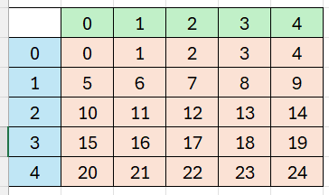

  <meta charset="utf-8" />
  <title>Informatik</title>
  <link rel="stylesheet" href="https://Hi2272.github.io/StyleMD.css">
 
 # Minesweeper

### 3. Erstelle die Klasse Spielfeld


  
  <section>
    <iframe
    srcdoc="<script>window.jo_doc = window.frameElement.textContent;</script><script src='https://Hi2272.github.io/include/js/includeide/includeIDE.js'></script>"
    width="100%" height="600" frameborder="0">
    {'id': 'Java', 'speed': 2000, 
    'withBottomPanel': true ,'withPCode': false ,'withConsole': true ,
    'withFileList': true ,'withErrorList': true}
    <script id="javaCode" type="plain/text" title="Spielfeld.java" src="03Spielfeld.java"></script>
    <script id="javaCode" type="plain/text" title="Kachel.java" src="03Kachel.java"></script>
  <script id="javaCode" type="plain/text" title="Platte.java" src="03Platte.java"></script>
  <script id="javaCode" type="plain/text" title="Mine.java" src="03Mine.java"></script>
  
  </script>

   </iframe>
</section>

#### Attribute
   Deklariere alle Attribute.
#### Konstruktor
Programmiere den Konstruktor, in dem 
   1. Die Attribute **breite, hoehe, spalten, zeilen und anzMinen** initialisiert werden.
   2. Das Attribut kachel initialisiert wird. Die Zahl der kacheln berechnet sich aus dem Produkt der Spalten- und Zeilenzahl.
   3. Diese Schleife eingefügt wird:
```C++
    for (int i = 0; i < anzMinen; i++) {
         int nr = Random.randint(0, kachel.length - 1);
         while (kachel[nr] instanceof Mine) {
            nr = Random.randint(0, kachel.length - 1);
         }
         kachel[nr] = new Mine(this, getSpalte(nr), getZeile(nr), breite, hoehe);
      }
```

4. Erläutere den Code dieser Schleife.
5. Die Schleife erzeugt eine Fehlermeldung, da die Methoden **getSpalte** und **getZeile** noch nicht programmiert sind. Wir erstellen Sie jetzt mit folgender Vorüberlegung:   


Um von der orange markierten Index-Nummer auf die grün markierte Spalten- und die blau markierte Zeilen-Nummer zu kommen, verwenden wir Rechenregeln aus der Grundschule: 
...  
 7 geteilt durch 5 ist 1 Rest 2.  
 8 geteilt durch 5 ist 1 Rest 3.  
 9 geteilt durch 5 ist 1 Rest 4.  
 10 geteilt durch 5 ist 2 Rest 0.  
 11 geteilt durch 5 ist 2 Rest 1.  
 ...  
Programmiere die Methoden **getSpalte(int nr)** und **getZeile(int nr)** mit Hilfe des Operators für die ganzzahlig Division **/** und den Rest dieser Divison **%** (Modulo-Operator).

Teste dein Programm - es müsste jetzt 10 Minen an zehn zufälligen Stellen des Spielfeldes erzeugen.

[weiter](04Spielfeld.html)  
