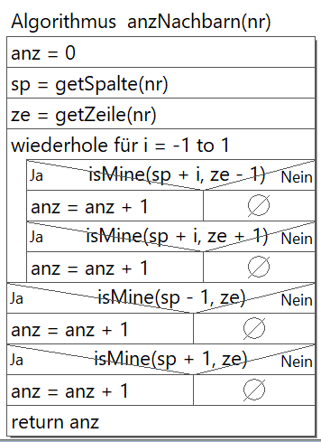

  <meta charset="utf-8" />
  <title>Informatik</title>
  <link rel="stylesheet" href="https://Hi2272.github.io/StyleMD.css">
 
 # Minesweeper

### 3. Erstelle die Klasse Spielfeld


#### Attribute
   Deklariere alle Attribute.
#### Konstruktor
Programmiere den Konstruktor, in dem 
   1. Die Attribute **breite, hoehe und anzMinen** initialisiert werden.
   2. Das Attribut kacheln initialisiert wird. Die Zahl der kacheln berechnet sich aus dem Produkt der breite und hoehe.
   3. Diese Schleife eingefügt wird:
```C++
    for (int i = 0; i < anzMinen; i++) {
         int nr = Random.randint(0, kachel.length - 1);
         while (kachel[nr] instanceof Mine) {
            nr = Random.randint(0, kachel.length - 1);
         }
         kachel[nr] = new Mine(this, getSpalte(nr), getZeile(nr), breite, hoehe);
      }
```

4. Erläutere den Code dieser Schleife.
5. In einer weiteren Schleife sollen die leeren Kacheln mit Platten initialisiert werden. 
6. Als letztes wird diese Schleife eingefügt:
```C++
    for (int i = 0; i < kachel.length; i++) {
         if(kachel[i] instanceof Platte) {
            kachel[i].setNachbarn(anzNachbarn(i));
         }
      }
  ```
  7. Erläutere diese Schleife
#### Methoden
1.  **isInGrid(x,y)**  
   Die Methode soll wahr zurückgeben, wenn sich x und y innerhalb der Grenzen des Gitters befinden. x muss also größer gleich 0 und kleiner als die Zahl der spalten sein. y muss analog größer als 0 und kleiner als die Zahl der zeilen sein.
   
2.  **getKachel-Methoden**  
Programmiere drei Methoden mit dem gleichen Namen, die sich in ihren Parametern unterscheiden:  
a) int nr: gibt die Kachel mit dem Index nr zurück.  
b) int x, int y: gibt die Kachel in der Spalte x und der Zeile y zurück. Hierzu muss die Nummer dieser Kache berechnet werden.  
c) ohne Parameter: gibt das gesamte Feld **kachel** zurück.

3.  **isMine(int x, int y)**  
Die Methode soll wahr zurückgeben, wenn x und y im Gitter liegen und die Kachel eine Mine ist.
4. **getZeile(int i)**
Die Methode gibt die Zeilennummer der Kachel mit dem Index i zurück. Diese Nummer kannst du durch eine einfach Integer-Division a/b berechnen. Das Ergebnis wird hierbei automatisch abgerundet. (Bsp.: 10/3 = 3)
5. **getSpalte(int i)**
Analog kann auch die Spalte zur Nummer berechnet werden. Hierzu musst du dir Modulo-Funktion a%b verwenden. Das Ergebnis ist der Rest der Integerdivison. (Bsp.: 10%3 = 1)
6. **getNachbarn(int nr)**  
   Setze dieses Struktogramm um:  
   
