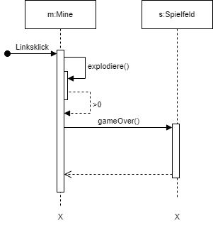

  <meta charset="utf-8" />
  <meta charset="utf-8" />
  <title>Sequenzdiagramme</title>
  <link rel="stylesheet" href="https://Hi2272.github.io/StyleMD.css">
 
  ## Linksklick auf eine Mine
   
 
 [zurück](index.html#aufgabenstellung) 

