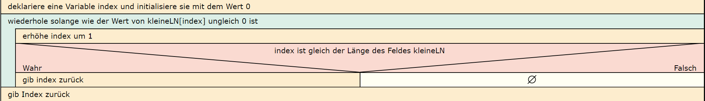

  <meta charset="utf-8" />
  <title>Informatik</title>
  <link rel="stylesheet" href="https://Hi2272.github.io/StyleMD.css">
 
 # Eine Notenverwaltung
## 1. Attribute und Konstruktoren
 Erstelle in der Klasse Fach folgende Attribute und passe den Konstruktor entsprechend an:  
 - ein Feld **kleineLN** mit 10 Elementen für die Noten in kleinen Leistungsnachweisen
 - ein Feld **grosseLN** mit 4 Elementen für die Noten in großen Leistungsnachweisen
 - ein Attribut **name** für den Namen des Faches (Bsp.: Informatik)
 - ein Attribut **kurz** für ein Kürzel des Faches (Bsp. Inf)
## 2. Eine Methode für die Anzahl der kleinen LN
1. Initalisiere im Konstruktor die ersten drei kleinen Leistungsnachweise mit den Werten 2,4 und 3.
2. Erstelle eine Methode **getAnzahlKleineLN()**, die die Zahl der kleinen Leistungsnachweise ausgibt.    
Setze hierzu dieses Struktogramm um:  
  

## 3. Eine Methode für die Anzahl der großen LN
### a) Einfache Lösung mit Codeduplikation
Um eine Methode zu programmieren, mit der die Anzahl der großen Leistungsnachweise ausgegeben wird, könnten wir einfach die Methode **getAnzahlKleineLN()** kopieren und das Attribut **kleineLN** durch das Attribut **grosseLN** ersetzen.  
Die Methode wäre also fast identisch - ein typisches Beispiel für **Codeduplikation**. Diese sollte vermieden werden.
### b) Bessere Lösung mit Parametern
Wir programmieren eine allgemeine Methode **getAnzahl**, die ein Feld von Zahl als Parameter hat.  Diese Methode rufen wir anschließend in der Methode **getAnzahlKleineLN** mit dem Attribut **kleineLN** als Parameter-Wert auf und in der Methode **getAnzahlGrosseLN** mit dem Attribut **grosseLN** als Parameter-Wert.  
1.  Ändere den Namen der Methode **getAnzahlKleineLN** in **getAnzahl**.
2.  Füge einen Parameter **feld** vom Typ int[] hinzu.
3.  Ersetze im Rumpf der Methode das Attribut **kleineLN** durch den Parameter **feld**.
4.  Programmiere eine neue Methode **getAnzahlKleineLN()**, die den Wert von **getAnzahl(kleineLN)** zurückgibt.
5.  Programmiere analog eine neue Methode **getAnzahlGrosseLN()**.
6.  Ändere die Methode **toString()** so ab, dass sie auch die Anzahl der großen LN ausgibt.  

Struktogramm:  

  

    2025 Rainer Hille  Unter Verwendung der  <a href='https://www.online-ide.de/'>Online-IDE von Martin Pabst</a> Hinweis: Der Code-Editor muss erst geladen werden. Klicke ggf. auf <b>Code Reset</b> um den Programmcode neu zu laden.

  

  
  <section>
    <iframe
    srcdoc=""
    width="100%" height="600" frameborder="0">
    {'id': 'Java', 'speed': 2000, 
    'withBottomPanel': true ,'withPCode': false ,'withConsole': true ,
    'withFileList': true ,'withErrorList': true}
    
    
  </script>
   </iframe>
</section>

[Weiter](../OIDE_Noten02MW/index.html)  
[zurück](../index.html)