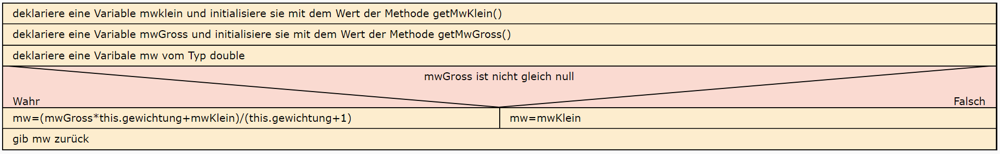
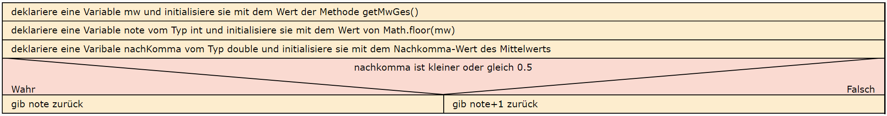

  <meta charset="utf-8" />
  <title>Informatik</title>
  <link rel="stylesheet" href="https://Hi2272.github.io/StyleMD.css">
 
 # Eine Notenverwaltung
## 5. Methoden für die Berechnung der Gesamtnote

### 1. Berechnung des Mittelwertes des Faches.
1. Um den Mittelwert zu berechnen, müssen wir zunächst festlegen, ob der Schnitt der großen LN einfach oder doppelt gewichtet wird.  

-  Deklariere ein Attribut **gewichtung** vom Typ **int**.
-  Erweitere die Parameterliste des Konstruktors um einen Parameter **gewichtung**.
-  Initialisiere das Attribut **gewichtung** im Konstruktor.
2. Erstelle eine Methode **getGesMw()** und setze folgendes Struktogramm um:  
    
### 2. Berechnung der Note
Erstelle eine Methode **getNote()** vom Typ **int**, die folgendes Struktogramm umsetzt:  
       

    2025 Rainer Hille  Unter Verwendung der  <a href='https://www.online-ide.de/'>Online-IDE von Martin Pabst</a> Hinweis: Der Code-Editor muss erst geladen werden. Klicke ggf. auf <b>Code Reset</b> um den Programmcode neu zu laden.

  

  
  <section>
    <iframe
    srcdoc=""
    width="100%" height="600" frameborder="0">
    {'id': 'Java', 'speed': 2000, 
    'withBottomPanel': true ,'withPCode': false ,'withConsole': true ,
    'withFileList': true ,'withErrorList': true}
    
    
  </script>
   </iframe>
</section>

[zurück](../OIDE_Noten03Noten/index.html)  
[Index](../index.html)