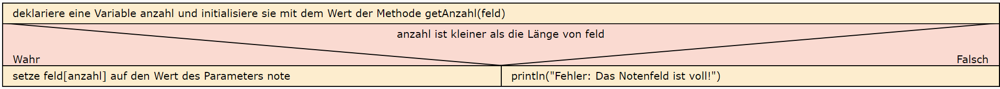

  <meta charset="utf-8" />
  <title>Informatik</title>
  <link rel="stylesheet" href="https://Hi2272.github.io/StyleMD.css">
 
# Eine Notenverwaltung
## 5. Speichern neuer Noten
Neue Noten werden hinter dem letzten Element in das Feld eingefügt. 
1. Erstelle eine allgemeine Methode **neuerLN**, die ein Feld **feld** vom Typ **int** und eine Note vom Typ **int** als Parameter übernimmt.
2. Setze dieses Struktogramm um:  

1. Erstelle eine Methode **neuerKleinerLN(int note)**, in der die allgemeine Methode **neuerLN** aufgerufen wird.
2. Erstelle analog eine Methode **neuerGrosserLN(int note)**.
  

    2025 Rainer Hille  Unter Verwendung der  <a href='https://www.online-ide.de/'>Online-IDE von Martin Pabst</a> Hinweis: Der Code-Editor muss erst geladen werden. Klicke ggf. auf <b>Code Reset</b> um den Programmcode neu zu laden.

  

  
  <section>
    <iframe
    srcdoc=""
    width="100%" height="600" frameborder="0">
    {'id': 'Java', 'speed': 2000, 
    'withBottomPanel': true ,'withPCode': false ,'withConsole': true ,
    'withFileList': true ,'withErrorList': true}
    
    
  </script>
   </iframe>
</section>

[zurück](../OIDE_Noten03Note/index.html)  
[weiter](../OIDE_Noten05Faecher/index.html)  
[Index](../index.html)