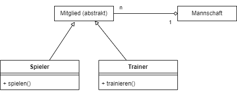

  <meta charset="utf-8" />
  <title>Informatik</title>
  <link rel="stylesheet" href="https://Hi2272.github.io/StyleMD.css">
 
# Polymorphie
## Klassendiagramm

## Aufgabenstellung

Dein Code zeigt eine Fehlermeldung in der Klasse **Verein**.  
Untersuche diesen Fehler, begründe weshalb er auftritt und schlage einen Weg vor, wie er behoben werden kann.  

  <section>
    <iframe
    srcdoc=""
    width="100%" height="600" frameborder="0">
    {'id': 'Java', 'speed': 2000, 
    'withBottomPanel': true ,'withPCode': false ,'withConsole': true ,
    'withFileList': true ,'withErrorList': true}
    
    
    
    
  </script>
  
   </iframe>
</section>

 [Index](../index.html)
