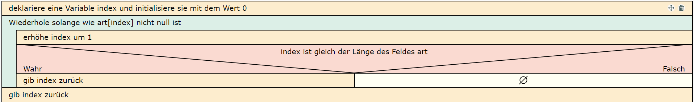

  <meta charset="utf-8" />
  <title>Informatik</title>
  <link rel="stylesheet" href="https://Hi2272.github.io/StyleMD.css">
 
 # Die Länge von Feldern
Das Programm wirft beim Ausführen einen Laufzeitfehler.  
1. Finde den Grund hierfür 
2. Erstelle eine Methode **getLaenge**, mit der die tatsächliche Anzahl der Objekte in einem Feld ermittelt wird.  
Setze dafür dieses Struktogramm um:  
  
3. Passe die Methode **printAlles()** so an, dass sie keinen Fehler mehr erzeugt.

  

    2025 Rainer Hille  Unter Verwendung der  <a href='https://www.online-ide.de/'>Online-IDE von Martin Pabst</a> Hinweis: Der Code-Editor muss erst geladen werden. Klicke ggf. auf <b>Code Reset</b> um den Programmcode neu zu laden.

  

  
  <section>
    <iframe
    srcdoc=""
    width="100%" height="600" frameborder="0">
    {'id': 'Java', 'speed': 2000, 
    'withBottomPanel': true ,'withPCode': false ,'withConsole': true ,
    'withFileList': true ,'withErrorList': true}
    
    
  </script>
   </iframe>
</section>

|[weiter](../OIDE_WS_2_MinIndex/index.html)|[zurück](../OIDE_WS_0_Sortieralgorithmus/index.html)|[Index](../index.html)|
|----|----|----|